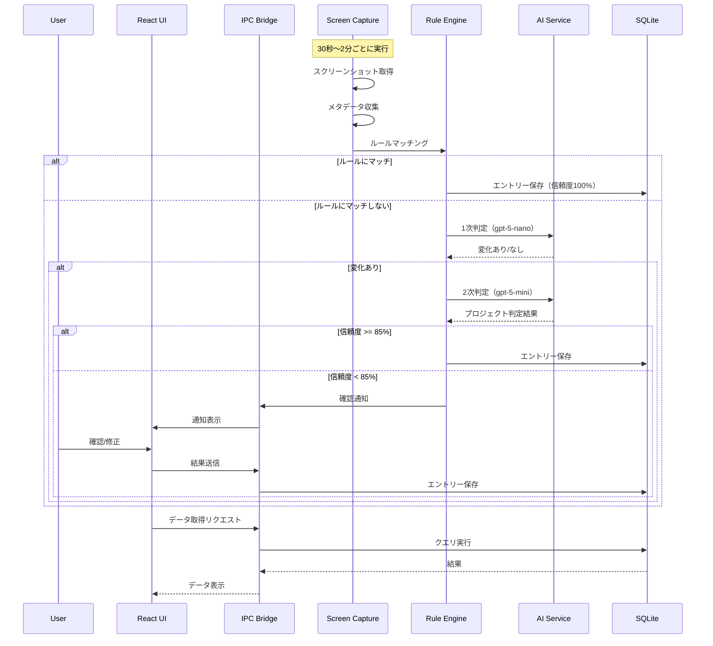

# AutoTracker アーキテクチャ設計書

**バージョン:** 1.0  
**作成日:** 2025年12月10日  
**参照:** 01_requirements.md

---

## 目次

1. [技術スタック](#1-技術スタック)
2. [システム構成図](#2-システム構成図)
3. [選択理由](#3-選択理由)
4. [初期コスト](#4-初期コスト)
5. [アーキテクチャ詳細](#5-アーキテクチャ詳細)
6. [データフロー](#6-データフロー)
7. [ディレクトリ構成](#7-ディレクトリ構成)
8. [モジュール設計](#8-モジュール設計)
9. [IPC通信設計](#9-ipc通信設計)
10. [外部API連携](#10-外部api連携)
11. [セキュリティ設計](#11-セキュリティ設計)
12. [パフォーマンス設計](#12-パフォーマンス設計)

---

## 1. 技術スタック

### 1.1 概要

| レイヤー | 技術 |
|---------|------|
| フロントエンド | React 18 + TypeScript 5 + Tailwind CSS 3 |
| バックエンド | Electron 28 + Node.js 20 |
| データベース | SQLite (better-sqlite3) |
| 認証 | なし（ローカルアプリ）/ Stripe（課金Phase 3） |
| インフラ | ローカル実行 + OpenAI API |
| その他 | Tesseract.js (OCR) + Zustand (状態管理) |

### 1.2 詳細スタック

```
┌─────────────────────────────────────────────────────────┐
│                    FRONTEND                              │
├─────────────────────────────────────────────────────────┤
│  React 18          : UIライブラリ                        │
│  TypeScript 5      : 型安全                              │
│  Tailwind CSS 3    : スタイリング                        │
│  shadcn/ui         : UIコンポーネント                    │
│  Recharts          : グラフ/チャート                     │
│  Zustand           : 状態管理                            │
│  React Hook Form   : フォーム管理                        │
│  Zod               : バリデーション                      │
│  Framer Motion     : アニメーション                      │
│  date-fns          : 日付処理                            │
├─────────────────────────────────────────────────────────┤
│                    BACKEND (Electron Main)               │
├─────────────────────────────────────────────────────────┤
│  Electron 28       : デスクトップアプリフレームワーク     │
│  Node.js 20        : ランタイム                          │
│  better-sqlite3    : SQLiteドライバ（同期API）           │
│  screenshot-desktop: スクリーンキャプチャ                │
│  active-win        : アクティブウィンドウ検出            │
│  electron-store    : 設定永続化                          │
│  node-cron         : スケジューリング                    │
│  Tesseract.js      : OCR処理                            │
│  sharp             : 画像処理/圧縮                       │
│  crypto-js         : AES暗号化                          │
├─────────────────────────────────────────────────────────┤
│                    EXTERNAL SERVICES                     │
├─────────────────────────────────────────────────────────┤
│  OpenAI API        : AI判定                              │
│   - gpt-5-nano     : 1次判定（変化検知）                 │
│   - gpt-5-mini     : 2次判定（詳細判定）                 │
├─────────────────────────────────────────────────────────┤
│                    DEV TOOLS                             │
├─────────────────────────────────────────────────────────┤
│  Vite              : ビルドツール                        │
│  Vitest            : テストフレームワーク                │
│  Playwright        : E2Eテスト                          │
│  ESLint            : Linter                             │
│  Prettier          : Formatter                          │
│  electron-builder  : パッケージング                      │
└─────────────────────────────────────────────────────────┘
```

---

## 2. システム構成図

### 2.1 全体アーキテクチャ


### 2.2 レイヤーアーキテクチャ


### 2.3 データフロー図



---

## 3. 選択理由

### 3.1 主要技術の選択理由

| 技術 | 選択理由 |
|------|----------|
| **Electron** | Windows/macOS両対応。スクリーンキャプチャやシステムAPI利用に必須。個人開発でクロスプラットフォーム対応の最適解。 |
| **React + TypeScript** | エコシステムが充実。型安全で保守性が高い。shadcn/uiでUI開発が効率化。 |
| **Tailwind CSS** | ユーティリティファーストで高速開発。カスタマイズ性が高くADHD配慮のダークUIに対応しやすい。 |
| **SQLite (better-sqlite3)** | サーバーレスでローカル完結。同期APIで扱いやすい。暗号化も可能（SQLCipher）。 |
| **Zustand** | 軽量でシンプルな状態管理。Redux比で学習コスト低、ボイラープレート少。 |
| **Tesseract.js** | オフラインOCR。外部APIに依存せず画面内テキストを抽出可能。 |
| **OpenAI API (gpt-5-nano/mini)** | 高精度なAI判定。nano（軽量/低コスト）とmini（高精度）の2段階で最適化。 |
| **Vite** | 高速ビルド。HMRが速くDX向上。Electronとの相性も良い。 |

### 3.2 不採用技術と理由

| 技術 | 不採用理由 |
|------|-----------|
| Tauri | Rust必須でハードル高い。画面キャプチャ周りのエコシステムがElectronに劣る。 |
| Redux | 個人開発には過剰。Zustandで十分。 |
| PostgreSQL | サーバー必要。ローカル完結のSQLiteで十分。 |
| Firebase | オフライン動作が主要件なので外部DB依存は避ける。 |
| Claude API | 要件でOpenAI API (gpt-5-nano/mini) が指定されている。 |

---

## 4. 初期コスト

### 4.1 月額コスト（個人開発時）

| サービス | 用途 | 月額 |
|---------|------|------|
| OpenAI API | AI判定 | $2.00 |
| GitHub | ソースコード管理 | $0 (Free) |
| Vercel | ランディングページ（Phase 3） | $0 (Free) |
| **合計** | | **$2.00/月** |

### 4.2 月額コスト（サービス運用時・100ユーザー想定）

| サービス | 用途 | 月額 |
|---------|------|------|
| OpenAI API | AI判定（100ユーザー分） | $200.00 |
| Stripe | 決済手数料（3.6%） | $54.00 |
| GitHub | ソースコード管理 | $0 (Free) |
| Vercel | ランディングページ | $0 (Free) |
| Sentry | エラー監視 | $0 (Free tier) |
| **合計** | | **$254.00/月** |

### 4.3 売上予測（100ユーザー @ $14.99）

| 項目 | 金額 |
|------|------|
| 売上 | $1,499.00 |
| コスト | $254.00 |
| **利益** | **$1,245.00** |
| **利益率** | **83%** |

---

## 5. アーキテクチャ詳細

### 5.1 Electronプロセス構成

```
┌─────────────────────────────────────────────────────────┐
│                    Main Process                          │
│  ┌─────────────────────────────────────────────────┐    │
│  │  Electron Main Entry (main.ts)                   │    │
│  │  - アプリライフサイクル管理                        │    │
│  │  - ウィンドウ管理                                 │    │
│  │  - システムトレイ                                 │    │
│  │  - 自動起動設定                                   │    │
│  └─────────────────────────────────────────────────┘    │
│                         │                                │
│  ┌─────────────────────────────────────────────────┐    │
│  │  IPC Handlers (ipc/*.ts)                         │    │
│  │  - project: プロジェクトCRUD                      │    │
│  │  - entry: エントリーCRUD                         │    │
│  │  - tracking: トラッキング制御                     │    │
│  │  - report: レポート生成                          │    │
│  │  - settings: 設定管理                            │    │
│  └─────────────────────────────────────────────────┘    │
│                         │                                │
│  ┌─────────────────────────────────────────────────┐    │
│  │  Services (services/*.ts)                        │    │
│  │  - ScreenCaptureService: 画面キャプチャ           │    │
│  │  - WindowMonitorService: ウィンドウ監視           │    │
│  │  - RuleMatchingService: ルールエンジン            │    │
│  │  - AIJudgmentService: AI判定                     │    │
│  │  - OCRService: テキスト抽出                      │    │
│  │  - DatabaseService: DB操作                       │    │
│  │  - EncryptionService: 暗号化                     │    │
│  │  - BackupService: バックアップ                    │    │
│  └─────────────────────────────────────────────────┘    │
│                         │                                │
│  ┌─────────────────────────────────────────────────┐    │
│  │  Core Logic (core/*.ts)                          │    │
│  │  - TrackingEngine: メインループ                   │    │
│  │  - ChangeDetector: 変化検知                      │    │
│  │  - ConfidenceCalculator: 信頼度計算               │    │
│  │  - TimeAggregator: 時間集計                      │    │
│  └─────────────────────────────────────────────────┘    │
└─────────────────────────────────────────────────────────┘
                          │
                          │ IPC (contextBridge)
                          ▼
┌─────────────────────────────────────────────────────────┐
│                   Renderer Process                       │
│  ┌─────────────────────────────────────────────────┐    │
│  │  React Application                               │    │
│  │  - Pages: Dashboard, Timeline, Projects, etc.   │    │
│  │  - Components: UI部品                           │    │
│  │  - Hooks: useTracking, useProjects, etc.        │    │
│  │  - Store: Zustand global state                  │    │
│  └─────────────────────────────────────────────────┘    │
└─────────────────────────────────────────────────────────┘
```

### 5.2 トラッキングエンジン詳細

```
┌─────────────────────────────────────────────────────────┐
│                  Tracking Engine                         │
├─────────────────────────────────────────────────────────┤
│                                                          │
│  ┌─────────────┐     ┌─────────────┐                    │
│  │   Timer     │────▶│  Capture    │                    │
│  │  (30s-2m)   │     │  Screenshot │                    │
│  └─────────────┘     └──────┬──────┘                    │
│                             │                            │
│  ┌─────────────┐            ▼                           │
│  │   Timer     │     ┌─────────────┐                    │
│  │   (5s)      │────▶│  Collect    │                    │
│  └─────────────┘     │  Metadata   │                    │
│                      └──────┬──────┘                    │
│                             │                            │
│                             ▼                            │
│                      ┌─────────────┐                    │
│                      │   Change    │                    │
│                      │  Detector   │                    │
│                      └──────┬──────┘                    │
│                             │                            │
│            ┌────────────────┼────────────────┐          │
│            ▼                ▼                ▼          │
│     ┌───────────┐   ┌───────────┐   ┌───────────┐      │
│     │  Layer 1  │   │  Layer 2  │   │  Layer 3  │      │
│     │  Title/   │   │   OCR     │   │   Image   │      │
│     │   URL     │   │   Text    │   │   Hash    │      │
│     └─────┬─────┘   └─────┬─────┘   └─────┬─────┘      │
│           │               │               │              │
│           └───────────────┼───────────────┘              │
│                           ▼                              │
│                    ┌─────────────┐                      │
│                    │    Rule     │                      │
│                    │   Matcher   │                      │
│                    └──────┬──────┘                      │
│                           │                              │
│            ┌──────────────┴──────────────┐              │
│            │ Match?                       │              │
│            ▼                              ▼              │
│     ┌─────────────┐              ┌─────────────┐        │
│     │   Save      │              │  AI Judge   │        │
│     │  (100%)     │              │   (nano)    │        │
│     └─────────────┘              └──────┬──────┘        │
│                                         │                │
│                         ┌───────────────┴───────────┐    │
│                         │ Changed?                   │    │
│                         ▼                            ▼    │
│                  ┌─────────────┐              ┌──────┐   │
│                  │  AI Judge   │              │ Skip │   │
│                  │   (mini)    │              └──────┘   │
│                  └──────┬──────┘                         │
│                         │                                │
│            ┌────────────┴────────────┐                  │
│            │ Confidence >= 85%?       │                  │
│            ▼                          ▼                  │
│     ┌─────────────┐          ┌─────────────┐            │
│     │   Save      │          │   Notify    │            │
│     │   Auto      │          │   User      │            │
│     └─────────────┘          └─────────────┘            │
│                                                          │
└─────────────────────────────────────────────────────────┘
```

---

## 6. データフロー

### 6.1 スクリーンショット保存フロー


### 6.2 AI判定フロー


### 6.3 レポート生成フロー


---

## 7. ディレクトリ構成

```
autotracker/
├── electron/                    # Electron Main Process
│   ├── main.ts                  # エントリーポイント
│   ├── preload.ts               # Preload Script
│   ├── ipc/                     # IPC Handlers
│   │   ├── index.ts
│   │   ├── project.ipc.ts
│   │   ├── entry.ipc.ts
│   │   ├── tracking.ipc.ts
│   │   ├── report.ipc.ts
│   │   └── settings.ipc.ts
│   ├── services/                # Business Services
│   │   ├── screen-capture.service.ts
│   │   ├── window-monitor.service.ts
│   │   ├── rule-matching.service.ts
│   │   ├── ai-judgment.service.ts
│   │   ├── ocr.service.ts
│   │   ├── database.service.ts
│   │   ├── encryption.service.ts
│   │   └── backup.service.ts
│   ├── core/                    # Core Logic
│   │   ├── tracking-engine.ts
│   │   ├── change-detector.ts
│   │   ├── confidence-calculator.ts
│   │   └── time-aggregator.ts
│   ├── database/                # Database
│   │   ├── schema.sql
│   │   ├── migrations/
│   │   └── repositories/
│   │       ├── project.repository.ts
│   │       ├── entry.repository.ts
│   │       ├── rule.repository.ts
│   │       └── screenshot.repository.ts
│   └── utils/                   # Utilities
│       ├── logger.ts
│       ├── constants.ts
│       └── helpers.ts
│
├── src/                         # React Renderer Process
│   ├── main.tsx                 # エントリーポイント
│   ├── App.tsx                  # ルートコンポーネント
│   ├── pages/                   # ページコンポーネント
│   │   ├── Dashboard.tsx
│   │   ├── Timeline.tsx
│   │   ├── Projects.tsx
│   │   ├── Reports.tsx
│   │   └── Settings.tsx
│   ├── components/              # 共通コンポーネント
│   │   ├── ui/                  # shadcn/ui
│   │   ├── layout/
│   │   │   ├── Sidebar.tsx
│   │   │   ├── Header.tsx
│   │   │   └── Layout.tsx
│   │   ├── dashboard/
│   │   │   ├── CurrentTask.tsx
│   │   │   ├── TodayStats.tsx
│   │   │   └── RecentTimeline.tsx
│   │   ├── timeline/
│   │   │   ├── TimelineEntry.tsx
│   │   │   ├── EntryEditor.tsx
│   │   │   └── TimelineFilter.tsx
│   │   ├── projects/
│   │   │   ├── ProjectCard.tsx
│   │   │   ├── ProjectForm.tsx
│   │   │   └── RuleEditor.tsx
│   │   └── common/
│   │       ├── ConfidenceBadge.tsx
│   │       ├── ProjectBadge.tsx
│   │       └── TimeDisplay.tsx
│   ├── hooks/                   # Custom Hooks
│   │   ├── useTracking.ts
│   │   ├── useProjects.ts
│   │   ├── useEntries.ts
│   │   ├── useReports.ts
│   │   └── useSettings.ts
│   ├── store/                   # Zustand Store
│   │   ├── index.ts
│   │   ├── tracking.store.ts
│   │   ├── projects.store.ts
│   │   └── settings.store.ts
│   ├── lib/                     # Utilities
│   │   ├── ipc.ts               # IPC client wrapper
│   │   ├── utils.ts
│   │   └── constants.ts
│   ├── types/                   # TypeScript Types
│   │   ├── index.ts
│   │   ├── project.types.ts
│   │   ├── entry.types.ts
│   │   └── api.types.ts
│   └── styles/                  # Global Styles
│       └── globals.css
│
├── shared/                      # 共有コード（Main/Renderer両方で使用）
│   ├── types/
│   │   ├── project.ts
│   │   ├── entry.ts
│   │   ├── rule.ts
│   │   └── settings.ts
│   ├── constants/
│   │   └── index.ts
│   └── utils/
│       └── date.ts
│
├── resources/                   # Static Resources
│   ├── icons/
│   └── fonts/
│
├── tests/                       # Tests
│   ├── unit/
│   ├── integration/
│   └── e2e/
│
├── scripts/                     # Build Scripts
│   ├── build.ts
│   └── release.ts
│
├── .github/                     # GitHub Actions
│   └── workflows/
│       ├── ci.yml
│       └── release.yml
│
├── package.json
├── tsconfig.json
├── vite.config.ts
├── electron-builder.yml
├── tailwind.config.js
└── README.md
```

---

## 8. モジュール設計

### 8.1 Main Process モジュール

#### 8.1.1 TrackingEngine

```typescript
// electron/core/tracking-engine.ts

interface TrackingEngineConfig {
  captureInterval: number;      // ms (30000-120000)
  metadataInterval: number;     // ms (5000)
  aiJudgmentMode: 'aggressive' | 'standard' | 'conservative';
  autoStartOnBoot: boolean;
}

class TrackingEngine {
  private isRunning: boolean = false;
  private captureTimer: NodeJS.Timer | null = null;
  private metadataTimer: NodeJS.Timer | null = null;
  
  constructor(
    private screenCapture: ScreenCaptureService,
    private windowMonitor: WindowMonitorService,
    private ruleMatching: RuleMatchingService,
    private aiJudgment: AIJudgmentService,
    private database: DatabaseService,
    private config: TrackingEngineConfig
  ) {}

  async start(): Promise<void>;
  async stop(): Promise<void>;
  async pause(): Promise<void>;
  async resume(): Promise<void>;
  
  private async captureLoop(): Promise<void>;
  private async metadataLoop(): Promise<void>;
  private async processCapture(screenshot: Screenshot, metadata: Metadata): Promise<void>;
}
```

#### 8.1.2 AIJudgmentService

```typescript
// electron/services/ai-judgment.service.ts

interface AIJudgmentResult {
  projectId: number | null;
  projectName: string;
  subtask: string;
  isWork: boolean;
  confidence: number;      // 0-100
  reasoning: string;
}

interface ChangeDetectionResult {
  changed: boolean;
  confidence: number;
}

class AIJudgmentService {
  constructor(
    private apiKey: string,
    private usageLogger: AIUsageLogRepository
  ) {}

  // 1次判定: 変化検知 (gpt-5-nano)
  async detectChange(
    prev: ScreenContext,
    current: ScreenContext
  ): Promise<ChangeDetectionResult>;

  // 2次判定: 詳細判定 (gpt-5-mini)
  async judgeProject(
    context: ScreenContext,
    projects: Project[],
    recentHistory: Entry[]
  ): Promise<AIJudgmentResult>;

  // コスト管理
  async getMonthlyUsage(): Promise<{ tokens: number; cost: number }>;
  async isWithinBudget(): Promise<boolean>;
}
```

#### 8.1.3 RuleMatchingService

```typescript
// electron/services/rule-matching.service.ts

interface RuleMatchResult {
  matched: boolean;
  projectId: number | null;
  ruleName: string | null;
  confidence: number;       // ルールマッチは100%
}

class RuleMatchingService {
  constructor(private ruleRepository: RuleRepository) {}

  async match(metadata: WindowMetadata): Promise<RuleMatchResult>;
  
  // ルールタイプ別マッチング
  private matchWindowTitle(pattern: string, title: string): boolean;
  private matchUrl(pattern: string, url: string): boolean;
  private matchKeyword(keywords: string[], text: string): boolean;
  private matchAppName(appNames: string[], current: string): boolean;
}
```

### 8.2 Renderer Process モジュール

#### 8.2.1 Zustand Store

```typescript
// src/store/tracking.store.ts

interface TrackingState {
  isRunning: boolean;
  currentEntry: Entry | null;
  currentProject: Project | null;
  elapsedTime: number;
  confidence: number;
  todayTotal: number;
  todayByProject: Record<number, number>;
}

interface TrackingActions {
  start: () => Promise<void>;
  stop: () => Promise<void>;
  pause: () => Promise<void>;
  setCurrentEntry: (entry: Entry | null) => void;
  updateElapsedTime: () => void;
  refreshTodayStats: () => Promise<void>;
}

const useTrackingStore = create<TrackingState & TrackingActions>((set, get) => ({
  // state
  isRunning: false,
  currentEntry: null,
  // ...
  
  // actions
  start: async () => {
    await window.api.tracking.start();
    set({ isRunning: true });
  },
  // ...
}));
```

#### 8.2.2 IPC Client

```typescript
// src/lib/ipc.ts

// Preload Scriptで公開されるAPI
interface ElectronAPI {
  tracking: {
    start: () => Promise<void>;
    stop: () => Promise<void>;
    getStatus: () => Promise<TrackingStatus>;
    onEntryCreated: (callback: (entry: Entry) => void) => void;
    onConfirmationNeeded: (callback: (data: ConfirmationData) => void) => void;
  };
  projects: {
    getAll: () => Promise<Project[]>;
    create: (data: CreateProjectDTO) => Promise<Project>;
    update: (id: number, data: UpdateProjectDTO) => Promise<Project>;
    delete: (id: number) => Promise<void>;
  };
  entries: {
    getByDateRange: (start: Date, end: Date) => Promise<Entry[]>;
    update: (id: number, data: UpdateEntryDTO) => Promise<Entry>;
    split: (id: number, splitTime: Date) => Promise<[Entry, Entry]>;
    merge: (ids: number[]) => Promise<Entry>;
  };
  reports: {
    generate: (type: ReportType, params: ReportParams) => Promise<Report>;
    export: (type: ExportType, report: Report) => Promise<string>;
  };
  settings: {
    get: () => Promise<Settings>;
    update: (settings: Partial<Settings>) => Promise<Settings>;
  };
}

declare global {
  interface Window {
    api: ElectronAPI;
  }
}
```

---

## 9. IPC通信設計

### 9.1 チャンネル一覧

| チャンネル | 方向 | 説明 |
|-----------|------|------|
| `tracking:start` | Renderer → Main | トラッキング開始 |
| `tracking:stop` | Renderer → Main | トラッキング停止 |
| `tracking:status` | Renderer → Main | ステータス取得 |
| `tracking:entry-created` | Main → Renderer | エントリー作成通知 |
| `tracking:confirmation-needed` | Main → Renderer | 確認依頼通知 |
| `tracking:confirmation-response` | Renderer → Main | 確認応答 |
| `project:get-all` | Renderer → Main | 全プロジェクト取得 |
| `project:create` | Renderer → Main | プロジェクト作成 |
| `project:update` | Renderer → Main | プロジェクト更新 |
| `project:delete` | Renderer → Main | プロジェクト削除 |
| `entry:get-range` | Renderer → Main | 期間指定でエントリー取得 |
| `entry:update` | Renderer → Main | エントリー更新 |
| `entry:split` | Renderer → Main | エントリー分割 |
| `entry:merge` | Renderer → Main | エントリー結合 |
| `report:generate` | Renderer → Main | レポート生成 |
| `report:export` | Renderer → Main | レポートエクスポート |
| `settings:get` | Renderer → Main | 設定取得 |
| `settings:update` | Renderer → Main | 設定更新 |

### 9.2 Preload Script

```typescript
// electron/preload.ts

import { contextBridge, ipcRenderer } from 'electron';

contextBridge.exposeInMainWorld('api', {
  tracking: {
    start: () => ipcRenderer.invoke('tracking:start'),
    stop: () => ipcRenderer.invoke('tracking:stop'),
    getStatus: () => ipcRenderer.invoke('tracking:status'),
    onEntryCreated: (callback: (entry: Entry) => void) => {
      ipcRenderer.on('tracking:entry-created', (_, entry) => callback(entry));
    },
    onConfirmationNeeded: (callback: (data: ConfirmationData) => void) => {
      ipcRenderer.on('tracking:confirmation-needed', (_, data) => callback(data));
    },
    respondConfirmation: (response: ConfirmationResponse) => {
      ipcRenderer.send('tracking:confirmation-response', response);
    },
  },
  projects: {
    getAll: () => ipcRenderer.invoke('project:get-all'),
    create: (data: CreateProjectDTO) => ipcRenderer.invoke('project:create', data),
    update: (id: number, data: UpdateProjectDTO) => ipcRenderer.invoke('project:update', id, data),
    delete: (id: number) => ipcRenderer.invoke('project:delete', id),
  },
  // ... other APIs
});
```

---

## 10. 外部API連携

### 10.1 OpenAI API設計

#### リクエスト制限対策

```typescript
// electron/services/ai-judgment.service.ts

class AIJudgmentService {
  private requestQueue: RequestQueue;
  private rateLimiter: RateLimiter;  // 60 req/min

  constructor() {
    this.rateLimiter = new RateLimiter({
      maxRequests: 60,
      windowMs: 60000,
    });
    this.requestQueue = new RequestQueue({
      concurrency: 3,
      retryOnRateLimit: true,
      retryDelay: (attempt) => Math.pow(2, attempt) * 1000, // 指数バックオフ
    });
  }
}
```

#### 1次判定プロンプト (gpt-5-nano)

```typescript
const CHANGE_DETECTION_PROMPT = `
あなたは画面変化検出AIです。
以下の情報を見て、作業内容が変化したかYes/Noで答えてください。

【前回の情報】
- ウィンドウタイトル: {prev_title}
- URL: {prev_url}
- OCRテキスト抜粋: {prev_text}

【今回の情報】
- ウィンドウタイトル: {current_title}
- URL: {current_url}
- OCRテキスト抜粋: {current_text}

回答形式（JSON）:
{
  "changed": true/false,
  "confidence": 0.0-1.0
}
`;
```

#### 2次判定プロンプト (gpt-5-mini)

```typescript
const PROJECT_JUDGMENT_PROMPT = `
あなたは作業内容判定AIです。
画面を見て、以下を判定してください。

【ユーザーのプロジェクト一覧】
{project_list}

【直近の作業履歴】
{recent_history}

【現在の画面情報】
- スクリーンショット: {screenshot_description}
- ウィンドウタイトル: {window_title}
- URL: {url}
- OCRテキスト: {ocr_text}

以下の形式で回答してください（JSON）:
{
  "project_id": number or null,
  "project_name": "プロジェクト名" or "不明",
  "subtask": "具体的な作業内容",
  "is_work": true/false,
  "confidence": 0.0-1.0,
  "reasoning": "判定理由"
}
`;
```

### 10.2 API呼び出し実装

```typescript
// electron/services/ai-judgment.service.ts

async detectChange(prev: ScreenContext, current: ScreenContext): Promise<ChangeDetectionResult> {
  const response = await this.rateLimiter.execute(() =>
    openai.chat.completions.create({
      model: 'gpt-5-nano',
      messages: [
        {
          role: 'system',
          content: 'You are a screen change detector. Respond only with JSON.',
        },
        {
          role: 'user',
          content: this.buildChangeDetectionPrompt(prev, current),
        },
      ],
      response_format: { type: 'json_object' },
      max_tokens: 50,
    })
  );

  // Usage logging
  await this.usageLogger.log({
    model: 'gpt-5-nano',
    tokensIn: response.usage?.prompt_tokens ?? 0,
    tokensOut: response.usage?.completion_tokens ?? 0,
    cost: this.calculateCost('gpt-5-nano', response.usage),
  });

  return JSON.parse(response.choices[0].message.content ?? '{}');
}
```

---

## 11. セキュリティ設計

### 11.1 データ暗号化

```typescript
// electron/services/encryption.service.ts

class EncryptionService {
  private algorithm = 'aes-256-gcm';
  
  // キーはOS keychainに保存
  private async getKey(): Promise<Buffer> {
    return await keytar.getPassword('autotracker', 'encryption-key') 
      ?? await this.generateAndStoreKey();
  }

  async encrypt(data: Buffer): Promise<EncryptedData> {
    const key = await this.getKey();
    const iv = crypto.randomBytes(16);
    const cipher = crypto.createCipheriv(this.algorithm, key, iv);
    
    const encrypted = Buffer.concat([
      cipher.update(data),
      cipher.final(),
    ]);
    
    return {
      data: encrypted,
      iv,
      authTag: cipher.getAuthTag(),
    };
  }

  async decrypt(encrypted: EncryptedData): Promise<Buffer> {
    const key = await this.getKey();
    const decipher = crypto.createDecipheriv(this.algorithm, key, encrypted.iv);
    decipher.setAuthTag(encrypted.authTag);
    
    return Buffer.concat([
      decipher.update(encrypted.data),
      decipher.final(),
    ]);
  }
}
```

### 11.2 パスワード画面検出

```typescript
// electron/services/screen-capture.service.ts

private isPasswordScreen(metadata: WindowMetadata, ocrText: string): boolean {
  // ウィンドウタイトルパターン
  const titlePatterns = [
    /password/i,
    /パスワード/,
    /ログイン/,
    /login/i,
    /sign in/i,
    /認証/,
  ];
  
  // OCRテキストパターン
  const textPatterns = [
    /type="password"/i,
    /●●●●/,
    /\*\*\*\*/,
  ];
  
  // ユーザー定義除外キーワード
  const userKeywords = this.settings.get('excludeKeywords') ?? [];
  
  return (
    titlePatterns.some(p => p.test(metadata.title)) ||
    textPatterns.some(p => p.test(ocrText)) ||
    userKeywords.some(k => ocrText.includes(k) || metadata.title.includes(k))
  );
}
```

### 11.3 APIキー管理

```typescript
// electron/services/settings.service.ts

class SettingsService {
  private store: ElectronStore;

  // APIキーは暗号化して保存
  async setApiKey(key: string): Promise<void> {
    const encrypted = await this.encryption.encrypt(Buffer.from(key));
    this.store.set('openai.apiKey', encrypted);
  }

  async getApiKey(): Promise<string | null> {
    const encrypted = this.store.get('openai.apiKey');
    if (!encrypted) return null;
    
    const decrypted = await this.encryption.decrypt(encrypted);
    return decrypted.toString();
  }
}
```

---

## 12. パフォーマンス設計

### 12.1 メモリ管理

```typescript
// electron/core/tracking-engine.ts

class TrackingEngine {
  // スクリーンショットキャッシュ（最大50MB）
  private screenshotCache = new LRUCache<string, Buffer>({
    max: 50 * 1024 * 1024,  // 50MB
    length: (buffer) => buffer.length,
  });

  // 定期的なガベージコレクション
  private scheduleGC() {
    setInterval(() => {
      if (global.gc) {
        global.gc();
      }
    }, 5 * 60 * 1000);  // 5分ごと
  }
}
```

### 12.2 画像最適化

```typescript
// electron/services/screen-capture.service.ts

async capture(): Promise<Buffer> {
  const screenshot = await screenshotDesktop();
  
  // Sharp で最適化
  const optimized = await sharp(screenshot)
    .resize(1280, 720, {
      fit: 'inside',
      withoutEnlargement: true,
    })
    .jpeg({
      quality: 80,
      progressive: true,
    })
    .toBuffer();
  
  // 目標: 200KB以下
  if (optimized.length > 200 * 1024) {
    return await sharp(screenshot)
      .resize(1024, 576)
      .jpeg({ quality: 60 })
      .toBuffer();
  }
  
  return optimized;
}
```

### 12.3 DBクエリ最適化

```typescript
// electron/database/repositories/entry.repository.ts

class EntryRepository {
  // インデックス作成
  createIndexes() {
    this.db.exec(`
      CREATE INDEX IF NOT EXISTS idx_entries_start_time ON entries(start_time);
      CREATE INDEX IF NOT EXISTS idx_entries_project_id ON entries(project_id);
      CREATE INDEX IF NOT EXISTS idx_entries_created_at ON entries(created_at);
    `);
  }

  // バッチ挿入
  insertBatch(entries: Entry[]) {
    const stmt = this.db.prepare(`
      INSERT INTO entries (project_id, start_time, end_time, confidence, ai_reasoning)
      VALUES (?, ?, ?, ?, ?)
    `);
    
    const insertMany = this.db.transaction((entries: Entry[]) => {
      for (const entry of entries) {
        stmt.run(entry.projectId, entry.startTime, entry.endTime, entry.confidence, entry.aiReasoning);
      }
    });
    
    insertMany(entries);
  }
}
```

### 12.4 CPU使用率制御

```typescript
// electron/core/tracking-engine.ts

class TrackingEngine {
  // アイドル時のCPU使用率を最小化
  private async captureLoop() {
    while (this.isRunning) {
      const start = Date.now();
      
      await this.processCapture();
      
      const elapsed = Date.now() - start;
      const sleepTime = Math.max(0, this.config.captureInterval - elapsed);
      
      // イベントループをブロックしない
      await new Promise(resolve => setTimeout(resolve, sleepTime));
    }
  }

  // 重い処理は低優先度で実行
  private async heavyProcess() {
    return new Promise((resolve) => {
      setImmediate(async () => {
        const result = await this.doHeavyWork();
        resolve(result);
      });
    });
  }
}
```

---

## 付録

### A. 環境変数

```env
# .env.development
NODE_ENV=development
OPENAI_API_KEY=sk-xxx
LOG_LEVEL=debug

# .env.production
NODE_ENV=production
LOG_LEVEL=info
```

### B. 設定ファイル構造

```typescript
// electron-store default values
const defaultSettings = {
  tracking: {
    captureInterval: 60000,        // 1分
    metadataInterval: 5000,        // 5秒
    aiJudgmentMode: 'standard',
    autoStartOnBoot: true,
    breakDetectionThreshold: 600000, // 10分
  },
  notifications: {
    confirmationMode: 'low-confidence', // always | low-confidence | never
    anomalyAlerts: true,
    reportReminders: true,
    reportReminderTime: '18:00',
  },
  privacy: {
    screenshotStorage: 'local',    // local | cloud
    screenshotRetention: 7,        // days
    passwordDetection: true,
    excludeKeywords: ['password', '秘密', '機密'],
  },
  appearance: {
    theme: 'dark',                 // dark | light | auto
    accentColor: 'amber',
    fontSize: 'medium',            // small | medium | large
  },
  ai: {
    monthlyBudget: 2.00,           // USD
    batchMode: true,
  },
};
```

---

**END OF DOCUMENT**
