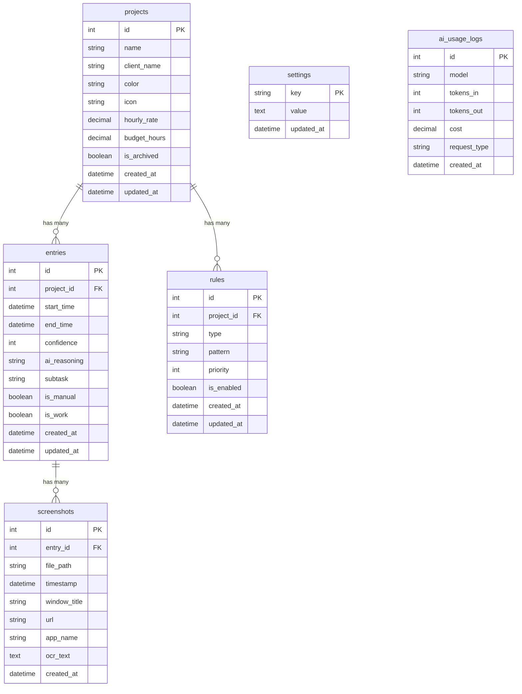

# AutoTracker データベース設計書

**バージョン:** 1.0  
**作成日:** 2025年12月10日  
**参照:** 01_requirements.md, 02_architecture.md

---

## 目次

1. [データベース概要](#1-データベース概要)
2. [ER図](#2-er図)
3. [テーブル定義](#3-テーブル定義)
4. [インデックス設計](#4-インデックス設計)
5. [マイグレーション](#5-マイグレーション)
6. [クエリ設計](#6-クエリ設計)
7. [データ保持ポリシー](#7-データ保持ポリシー)
8. [バックアップ設計](#8-バックアップ設計)
9. [パフォーマンス最適化](#9-パフォーマンス最適化)

---

## 1. データベース概要

### 1.1 データベースエンジン

| 項目 | 内容 |
|------|------|
| エンジン | SQLite 3.x |
| ドライバ | better-sqlite3 |
| 暗号化 | AES-256（将来的にSQLCipher検討） |
| 保存場所 | `{userData}/autotracker.db` |
| 文字コード | UTF-8 |

### 1.2 設計方針

- **ローカルファースト**: オフラインで完全動作
- **シンプル**: 個人開発向けに正規化を最小限に
- **拡張性**: Phase 2以降の機能追加に対応
- **パフォーマンス**: 頻出クエリに最適化したインデックス

### 1.3 テーブル一覧

| テーブル名 | 説明 | レコード増加 |
|-----------|------|-------------|
| projects | プロジェクト | 低（最大100件） |
| entries | 時間エントリー | 高（1日50-100件） |
| rules | 自動検出ルール | 低（プロジェクトごと数件） |
| screenshots | スクリーンショット情報 | 高（1日100-200件） |
| settings | アプリ設定 | 極低（固定） |
| ai_usage_logs | AI使用履歴 | 中（1日10-30件） |
| schema_migrations | マイグレーション履歴 | 極低 |

---

## 2. ER図

### 2.1 概念ER図



### 2.2 物理ER図

```
┌─────────────────────────────────────────────────────────────────────┐
│                            projects                                  │
├─────────────────────────────────────────────────────────────────────┤
│ id            INTEGER PRIMARY KEY AUTOINCREMENT                      │
│ name          TEXT NOT NULL                                          │
│ client_name   TEXT                                                   │
│ color         TEXT NOT NULL DEFAULT '#E5C890'                        │
│ icon          TEXT DEFAULT '📁'                                      │
│ hourly_rate   REAL                                                   │
│ budget_hours  REAL                                                   │
│ is_archived   INTEGER NOT NULL DEFAULT 0                             │
│ created_at    TEXT NOT NULL DEFAULT (datetime('now'))                │
│ updated_at    TEXT NOT NULL DEFAULT (datetime('now'))                │
└─────────────────────────────────────────────────────────────────────┘
                                    │
                    ┌───────────────┴───────────────┐
                    │                               │
                    ▼                               ▼
┌───────────────────────────────────┐ ┌───────────────────────────────────┐
│            entries                 │ │             rules                  │
├───────────────────────────────────┤ ├───────────────────────────────────┤
│ id            INTEGER PK AI        │ │ id            INTEGER PK AI        │
│ project_id    INTEGER FK           │ │ project_id    INTEGER FK           │
│ start_time    TEXT NOT NULL        │ │ type          TEXT NOT NULL        │
│ end_time      TEXT                 │ │ pattern       TEXT NOT NULL        │
│ confidence    INTEGER DEFAULT 0    │ │ priority      INTEGER DEFAULT 0    │
│ ai_reasoning  TEXT                 │ │ is_enabled    INTEGER DEFAULT 1    │
│ subtask       TEXT                 │ │ created_at    TEXT                 │
│ is_manual     INTEGER DEFAULT 0    │ │ updated_at    TEXT                 │
│ is_work       INTEGER DEFAULT 1    │ └───────────────────────────────────┘
│ created_at    TEXT                 │
│ updated_at    TEXT                 │
└───────────────────────────────────┘
                    │
                    ▼
┌───────────────────────────────────┐
│          screenshots               │
├───────────────────────────────────┤
│ id            INTEGER PK AI        │
│ entry_id      INTEGER FK           │
│ file_path     TEXT NOT NULL        │
│ timestamp     TEXT NOT NULL        │
│ window_title  TEXT                 │
│ url           TEXT                 │
│ app_name      TEXT                 │
│ ocr_text      TEXT                 │
│ created_at    TEXT                 │
└───────────────────────────────────┘

┌───────────────────────────────────┐ ┌───────────────────────────────────┐
│           settings                 │ │        ai_usage_logs              │
├───────────────────────────────────┤ ├───────────────────────────────────┤
│ key           TEXT PK              │ │ id            INTEGER PK AI        │
│ value         TEXT                 │ │ model         TEXT NOT NULL        │
│ updated_at    TEXT                 │ │ tokens_in     INTEGER DEFAULT 0    │
└───────────────────────────────────┘ │ tokens_out    INTEGER DEFAULT 0    │
                                      │ cost          REAL DEFAULT 0        │
┌───────────────────────────────────┐ │ request_type  TEXT                 │
│      schema_migrations             │ │ created_at    TEXT                 │
├───────────────────────────────────┤ └───────────────────────────────────┘
│ version       INTEGER PK           │
│ name          TEXT NOT NULL        │
│ applied_at    TEXT                 │
└───────────────────────────────────┘
```

---

## 3. テーブル定義

### 3.1 projects（プロジェクト）

プロジェクト/案件の基本情報を管理。

```sql
CREATE TABLE projects (
    id            INTEGER PRIMARY KEY AUTOINCREMENT,
    name          TEXT NOT NULL,
    client_name   TEXT,
    color         TEXT NOT NULL DEFAULT '#E5C890',
    icon          TEXT DEFAULT '📁',
    hourly_rate   REAL,
    budget_hours  REAL,
    is_archived   INTEGER NOT NULL DEFAULT 0,
    created_at    TEXT NOT NULL DEFAULT (datetime('now')),
    updated_at    TEXT NOT NULL DEFAULT (datetime('now'))
);

-- トリガー: updated_at自動更新
CREATE TRIGGER update_projects_timestamp 
AFTER UPDATE ON projects
BEGIN
    UPDATE projects SET updated_at = datetime('now') WHERE id = NEW.id;
END;
```

| カラム | 型 | NULL | デフォルト | 説明 |
|--------|-----|------|-----------|------|
| id | INTEGER | NO | AUTO | 主キー |
| name | TEXT | NO | - | プロジェクト名 |
| client_name | TEXT | YES | NULL | クライアント名 |
| color | TEXT | NO | #E5C890 | 表示カラー（HEX） |
| icon | TEXT | YES | 📁 | 絵文字アイコン |
| hourly_rate | REAL | YES | NULL | 時給（USD） |
| budget_hours | REAL | YES | NULL | 月間予算時間 |
| is_archived | INTEGER | NO | 0 | アーカイブフラグ |
| created_at | TEXT | NO | now() | 作成日時 |
| updated_at | TEXT | NO | now() | 更新日時 |

### 3.2 entries（時間エントリー）

作業時間の記録を管理。

```sql
CREATE TABLE entries (
    id            INTEGER PRIMARY KEY AUTOINCREMENT,
    project_id    INTEGER,
    start_time    TEXT NOT NULL,
    end_time      TEXT,
    confidence    INTEGER NOT NULL DEFAULT 0,
    ai_reasoning  TEXT,
    subtask       TEXT,
    is_manual     INTEGER NOT NULL DEFAULT 0,
    is_work       INTEGER NOT NULL DEFAULT 1,
    created_at    TEXT NOT NULL DEFAULT (datetime('now')),
    updated_at    TEXT NOT NULL DEFAULT (datetime('now')),
    FOREIGN KEY (project_id) REFERENCES projects(id) ON DELETE SET NULL
);

CREATE TRIGGER update_entries_timestamp 
AFTER UPDATE ON entries
BEGIN
    UPDATE entries SET updated_at = datetime('now') WHERE id = NEW.id;
END;
```

| カラム | 型 | NULL | デフォルト | 説明 |
|--------|-----|------|-----------|------|
| id | INTEGER | NO | AUTO | 主キー |
| project_id | INTEGER | YES | NULL | プロジェクトID（FK） |
| start_time | TEXT | NO | - | 開始時刻（ISO8601） |
| end_time | TEXT | YES | NULL | 終了時刻（ISO8601、NULLは進行中） |
| confidence | INTEGER | NO | 0 | 信頼度（0-100） |
| ai_reasoning | TEXT | YES | NULL | AI判定理由 |
| subtask | TEXT | YES | NULL | サブタスク/作業内容 |
| is_manual | INTEGER | NO | 0 | 手動入力フラグ |
| is_work | INTEGER | NO | 1 | 業務フラグ（0=非業務） |
| created_at | TEXT | NO | now() | 作成日時 |
| updated_at | TEXT | NO | now() | 更新日時 |

### 3.3 rules（自動検出ルール）

プロジェクト自動判定のルールを管理。

```sql
CREATE TABLE rules (
    id            INTEGER PRIMARY KEY AUTOINCREMENT,
    project_id    INTEGER NOT NULL,
    type          TEXT NOT NULL,
    pattern       TEXT NOT NULL,
    priority      INTEGER NOT NULL DEFAULT 0,
    is_enabled    INTEGER NOT NULL DEFAULT 1,
    created_at    TEXT NOT NULL DEFAULT (datetime('now')),
    updated_at    TEXT NOT NULL DEFAULT (datetime('now')),
    FOREIGN KEY (project_id) REFERENCES projects(id) ON DELETE CASCADE
);

CREATE TRIGGER update_rules_timestamp 
AFTER UPDATE ON rules
BEGIN
    UPDATE rules SET updated_at = datetime('now') WHERE id = NEW.id;
END;
```

| カラム | 型 | NULL | デフォルト | 説明 |
|--------|-----|------|-----------|------|
| id | INTEGER | NO | AUTO | 主キー |
| project_id | INTEGER | NO | - | プロジェクトID（FK） |
| type | TEXT | NO | - | ルールタイプ（下記参照） |
| pattern | TEXT | NO | - | マッチパターン |
| priority | INTEGER | NO | 0 | 優先度（高いほど優先） |
| is_enabled | INTEGER | NO | 1 | 有効フラグ |
| created_at | TEXT | NO | now() | 作成日時 |
| updated_at | TEXT | NO | now() | 更新日時 |

**ルールタイプ（type）**:

| タイプ | 説明 | pattern例 |
|--------|------|----------|
| window_title | ウィンドウタイトル（正規表現） | `.*Slack.*` |
| url | URL（正規表現） | `https://github.com/myrepo.*` |
| keyword | キーワード（JSON配列） | `["TEPCO", "東京電力"]` |
| app_name | アプリ名（完全一致） | `Figma` |
| file_path | ファイルパス（正規表現） | `.*\/projects\/autotracker\/.*` |

### 3.4 screenshots（スクリーンショット）

スクリーンショットのメタデータを管理。画像ファイル自体は別途ファイルシステムに保存。

```sql
CREATE TABLE screenshots (
    id            INTEGER PRIMARY KEY AUTOINCREMENT,
    entry_id      INTEGER,
    file_path     TEXT NOT NULL,
    timestamp     TEXT NOT NULL,
    window_title  TEXT,
    url           TEXT,
    app_name      TEXT,
    ocr_text      TEXT,
    created_at    TEXT NOT NULL DEFAULT (datetime('now')),
    FOREIGN KEY (entry_id) REFERENCES entries(id) ON DELETE SET NULL
);
```

| カラム | 型 | NULL | デフォルト | 説明 |
|--------|-----|------|-----------|------|
| id | INTEGER | NO | AUTO | 主キー |
| entry_id | INTEGER | YES | NULL | エントリーID（FK） |
| file_path | TEXT | NO | - | 暗号化ファイルパス |
| timestamp | TEXT | NO | - | キャプチャ時刻（ISO8601） |
| window_title | TEXT | YES | NULL | ウィンドウタイトル |
| url | TEXT | YES | NULL | ブラウザURL |
| app_name | TEXT | YES | NULL | アプリケーション名 |
| ocr_text | TEXT | YES | NULL | OCR抽出テキスト |
| created_at | TEXT | NO | now() | 作成日時 |

### 3.5 settings（設定）

アプリケーション設定をKey-Value形式で管理。

```sql
CREATE TABLE settings (
    key           TEXT PRIMARY KEY,
    value         TEXT,
    updated_at    TEXT NOT NULL DEFAULT (datetime('now'))
);

CREATE TRIGGER update_settings_timestamp 
AFTER UPDATE ON settings
BEGIN
    UPDATE settings SET updated_at = datetime('now') WHERE key = NEW.key;
END;
```

| カラム | 型 | NULL | デフォルト | 説明 |
|--------|-----|------|-----------|------|
| key | TEXT | NO | - | 設定キー（主キー） |
| value | TEXT | YES | NULL | 設定値（JSON文字列） |
| updated_at | TEXT | NO | now() | 更新日時 |

**設定キー例**:

| キー | 値の型 | 説明 |
|------|--------|------|
| tracking.captureInterval | number | キャプチャ間隔（ms） |
| tracking.metadataInterval | number | メタデータ収集間隔（ms） |
| tracking.aiJudgmentMode | string | AI判定モード |
| tracking.autoStartOnBoot | boolean | 自動起動 |
| notifications.confirmationMode | string | 確認モード |
| privacy.screenshotRetention | number | 保存期間（日） |
| privacy.excludeKeywords | string[] | 除外キーワード |
| appearance.theme | string | テーマ |
| ai.monthlyBudget | number | AI月間予算（USD） |

### 3.6 ai_usage_logs（AI使用ログ）

OpenAI API使用状況を追跡。

```sql
CREATE TABLE ai_usage_logs (
    id            INTEGER PRIMARY KEY AUTOINCREMENT,
    model         TEXT NOT NULL,
    tokens_in     INTEGER NOT NULL DEFAULT 0,
    tokens_out    INTEGER NOT NULL DEFAULT 0,
    cost          REAL NOT NULL DEFAULT 0,
    request_type  TEXT,
    created_at    TEXT NOT NULL DEFAULT (datetime('now'))
);
```

| カラム | 型 | NULL | デフォルト | 説明 |
|--------|-----|------|-----------|------|
| id | INTEGER | NO | AUTO | 主キー |
| model | TEXT | NO | - | モデル名（gpt-5-nano/gpt-5-mini） |
| tokens_in | INTEGER | NO | 0 | 入力トークン数 |
| tokens_out | INTEGER | NO | 0 | 出力トークン数 |
| cost | REAL | NO | 0 | コスト（USD） |
| request_type | TEXT | YES | NULL | リクエスト種別（change_detection/project_judgment） |
| created_at | TEXT | NO | now() | 作成日時 |

### 3.7 schema_migrations（マイグレーション履歴）

```sql
CREATE TABLE schema_migrations (
    version       INTEGER PRIMARY KEY,
    name          TEXT NOT NULL,
    applied_at    TEXT NOT NULL DEFAULT (datetime('now'))
);
```

---

## 4. インデックス設計

### 4.1 インデックス一覧

```sql
-- entries: 日付範囲検索の高速化
CREATE INDEX idx_entries_start_time ON entries(start_time);
CREATE INDEX idx_entries_end_time ON entries(end_time);

-- entries: プロジェクト別取得の高速化
CREATE INDEX idx_entries_project_id ON entries(project_id);

-- entries: 日付+プロジェクトの複合インデックス（レポート用）
CREATE INDEX idx_entries_project_date ON entries(project_id, start_time);

-- screenshots: エントリー別取得
CREATE INDEX idx_screenshots_entry_id ON screenshots(entry_id);

-- screenshots: 日付範囲での削除用
CREATE INDEX idx_screenshots_timestamp ON screenshots(timestamp);

-- rules: プロジェクト別取得
CREATE INDEX idx_rules_project_id ON rules(project_id);

-- rules: 有効ルールのみ取得
CREATE INDEX idx_rules_enabled ON rules(is_enabled) WHERE is_enabled = 1;

-- ai_usage_logs: 月間集計用
CREATE INDEX idx_ai_usage_created ON ai_usage_logs(created_at);
```

### 4.2 インデックス選定理由

| インデックス | 用途 | クエリ例 |
|-------------|------|---------|
| idx_entries_start_time | 日次/週次/月次レポート | `WHERE start_time BETWEEN ? AND ?` |
| idx_entries_project_id | プロジェクト詳細画面 | `WHERE project_id = ?` |
| idx_entries_project_date | プロジェクト×期間のレポート | `WHERE project_id = ? AND start_time BETWEEN ? AND ?` |
| idx_screenshots_entry_id | エントリー詳細表示 | `WHERE entry_id = ?` |
| idx_screenshots_timestamp | 古いスクリーンショット削除 | `WHERE timestamp < ?` |

---

## 5. マイグレーション

### 5.1 マイグレーション管理

```typescript
// electron/database/migrator.ts

interface Migration {
  version: number;
  name: string;
  up: (db: Database) => void;
  down: (db: Database) => void;
}

class Migrator {
  private migrations: Migration[] = [];

  async migrate(db: Database): Promise<void> {
    const currentVersion = this.getCurrentVersion(db);
    const pendingMigrations = this.migrations.filter(m => m.version > currentVersion);

    for (const migration of pendingMigrations) {
      console.log(`Applying migration ${migration.version}: ${migration.name}`);
      
      db.transaction(() => {
        migration.up(db);
        db.prepare('INSERT INTO schema_migrations (version, name) VALUES (?, ?)')
          .run(migration.version, migration.name);
      })();
    }
  }
}
```

### 5.2 初期マイグレーション（v1）

```typescript
// electron/database/migrations/001_initial.ts

export const migration001: Migration = {
  version: 1,
  name: 'initial_schema',
  up: (db) => {
    db.exec(`
      -- projects
      CREATE TABLE projects (
        id            INTEGER PRIMARY KEY AUTOINCREMENT,
        name          TEXT NOT NULL,
        client_name   TEXT,
        color         TEXT NOT NULL DEFAULT '#E5C890',
        icon          TEXT DEFAULT '📁',
        hourly_rate   REAL,
        budget_hours  REAL,
        is_archived   INTEGER NOT NULL DEFAULT 0,
        created_at    TEXT NOT NULL DEFAULT (datetime('now')),
        updated_at    TEXT NOT NULL DEFAULT (datetime('now'))
      );

      -- entries
      CREATE TABLE entries (
        id            INTEGER PRIMARY KEY AUTOINCREMENT,
        project_id    INTEGER,
        start_time    TEXT NOT NULL,
        end_time      TEXT,
        confidence    INTEGER NOT NULL DEFAULT 0,
        ai_reasoning  TEXT,
        subtask       TEXT,
        is_manual     INTEGER NOT NULL DEFAULT 0,
        is_work       INTEGER NOT NULL DEFAULT 1,
        created_at    TEXT NOT NULL DEFAULT (datetime('now')),
        updated_at    TEXT NOT NULL DEFAULT (datetime('now')),
        FOREIGN KEY (project_id) REFERENCES projects(id) ON DELETE SET NULL
      );

      -- rules
      CREATE TABLE rules (
        id            INTEGER PRIMARY KEY AUTOINCREMENT,
        project_id    INTEGER NOT NULL,
        type          TEXT NOT NULL,
        pattern       TEXT NOT NULL,
        priority      INTEGER NOT NULL DEFAULT 0,
        is_enabled    INTEGER NOT NULL DEFAULT 1,
        created_at    TEXT NOT NULL DEFAULT (datetime('now')),
        updated_at    TEXT NOT NULL DEFAULT (datetime('now')),
        FOREIGN KEY (project_id) REFERENCES projects(id) ON DELETE CASCADE
      );

      -- screenshots
      CREATE TABLE screenshots (
        id            INTEGER PRIMARY KEY AUTOINCREMENT,
        entry_id      INTEGER,
        file_path     TEXT NOT NULL,
        timestamp     TEXT NOT NULL,
        window_title  TEXT,
        url           TEXT,
        app_name      TEXT,
        ocr_text      TEXT,
        created_at    TEXT NOT NULL DEFAULT (datetime('now')),
        FOREIGN KEY (entry_id) REFERENCES entries(id) ON DELETE SET NULL
      );

      -- settings
      CREATE TABLE settings (
        key           TEXT PRIMARY KEY,
        value         TEXT,
        updated_at    TEXT NOT NULL DEFAULT (datetime('now'))
      );

      -- ai_usage_logs
      CREATE TABLE ai_usage_logs (
        id            INTEGER PRIMARY KEY AUTOINCREMENT,
        model         TEXT NOT NULL,
        tokens_in     INTEGER NOT NULL DEFAULT 0,
        tokens_out    INTEGER NOT NULL DEFAULT 0,
        cost          REAL NOT NULL DEFAULT 0,
        request_type  TEXT,
        created_at    TEXT NOT NULL DEFAULT (datetime('now'))
      );

      -- schema_migrations
      CREATE TABLE schema_migrations (
        version       INTEGER PRIMARY KEY,
        name          TEXT NOT NULL,
        applied_at    TEXT NOT NULL DEFAULT (datetime('now'))
      );

      -- Indexes
      CREATE INDEX idx_entries_start_time ON entries(start_time);
      CREATE INDEX idx_entries_end_time ON entries(end_time);
      CREATE INDEX idx_entries_project_id ON entries(project_id);
      CREATE INDEX idx_entries_project_date ON entries(project_id, start_time);
      CREATE INDEX idx_screenshots_entry_id ON screenshots(entry_id);
      CREATE INDEX idx_screenshots_timestamp ON screenshots(timestamp);
      CREATE INDEX idx_rules_project_id ON rules(project_id);
      CREATE INDEX idx_rules_enabled ON rules(is_enabled) WHERE is_enabled = 1;
      CREATE INDEX idx_ai_usage_created ON ai_usage_logs(created_at);

      -- Triggers
      CREATE TRIGGER update_projects_timestamp 
      AFTER UPDATE ON projects
      BEGIN
        UPDATE projects SET updated_at = datetime('now') WHERE id = NEW.id;
      END;

      CREATE TRIGGER update_entries_timestamp 
      AFTER UPDATE ON entries
      BEGIN
        UPDATE entries SET updated_at = datetime('now') WHERE id = NEW.id;
      END;

      CREATE TRIGGER update_rules_timestamp 
      AFTER UPDATE ON rules
      BEGIN
        UPDATE rules SET updated_at = datetime('now') WHERE id = NEW.id;
      END;

      CREATE TRIGGER update_settings_timestamp 
      AFTER UPDATE ON settings
      BEGIN
        UPDATE settings SET updated_at = datetime('now') WHERE key = NEW.key;
      END;

      -- Default settings
      INSERT INTO settings (key, value) VALUES
        ('tracking.captureInterval', '60000'),
        ('tracking.metadataInterval', '5000'),
        ('tracking.aiJudgmentMode', '"standard"'),
        ('tracking.autoStartOnBoot', 'true'),
        ('notifications.confirmationMode', '"low-confidence"'),
        ('notifications.anomalyAlerts', 'true'),
        ('privacy.screenshotRetention', '7'),
        ('privacy.passwordDetection', 'true'),
        ('privacy.excludeKeywords', '["password", "秘密", "機密"]'),
        ('appearance.theme', '"dark"'),
        ('appearance.fontSize', '"medium"'),
        ('ai.monthlyBudget', '2.00');
    `);
  },
  down: (db) => {
    db.exec(`
      DROP TABLE IF EXISTS ai_usage_logs;
      DROP TABLE IF EXISTS screenshots;
      DROP TABLE IF EXISTS rules;
      DROP TABLE IF EXISTS entries;
      DROP TABLE IF EXISTS projects;
      DROP TABLE IF EXISTS settings;
      DROP TABLE IF EXISTS schema_migrations;
    `);
  },
};
```

---

## 6. クエリ設計

### 6.1 プロジェクト関連

```typescript
// electron/database/repositories/project.repository.ts

class ProjectRepository {
  // 全プロジェクト取得（アクティブのみ）
  findAll(): Project[] {
    return this.db.prepare(`
      SELECT * FROM projects 
      WHERE is_archived = 0 
      ORDER BY name ASC
    `).all();
  }

  // アーカイブ含む全取得
  findAllWithArchived(): Project[] {
    return this.db.prepare(`
      SELECT * FROM projects 
      ORDER BY is_archived ASC, name ASC
    `).all();
  }

  // ID指定取得
  findById(id: number): Project | null {
    return this.db.prepare(`
      SELECT * FROM projects WHERE id = ?
    `).get(id);
  }

  // プロジェクト作成
  create(data: CreateProjectDTO): Project {
    const result = this.db.prepare(`
      INSERT INTO projects (name, client_name, color, icon, hourly_rate, budget_hours)
      VALUES (?, ?, ?, ?, ?, ?)
    `).run(data.name, data.clientName, data.color, data.icon, data.hourlyRate, data.budgetHours);
    
    return this.findById(result.lastInsertRowid as number)!;
  }

  // プロジェクト更新
  update(id: number, data: UpdateProjectDTO): Project {
    const fields: string[] = [];
    const values: any[] = [];

    if (data.name !== undefined) { fields.push('name = ?'); values.push(data.name); }
    if (data.clientName !== undefined) { fields.push('client_name = ?'); values.push(data.clientName); }
    if (data.color !== undefined) { fields.push('color = ?'); values.push(data.color); }
    if (data.icon !== undefined) { fields.push('icon = ?'); values.push(data.icon); }
    if (data.hourlyRate !== undefined) { fields.push('hourly_rate = ?'); values.push(data.hourlyRate); }
    if (data.budgetHours !== undefined) { fields.push('budget_hours = ?'); values.push(data.budgetHours); }
    if (data.isArchived !== undefined) { fields.push('is_archived = ?'); values.push(data.isArchived ? 1 : 0); }

    values.push(id);

    this.db.prepare(`
      UPDATE projects SET ${fields.join(', ')} WHERE id = ?
    `).run(...values);

    return this.findById(id)!;
  }

  // プロジェクト削除
  delete(id: number): void {
    this.db.prepare('DELETE FROM projects WHERE id = ?').run(id);
  }

  // プロジェクト別合計時間（期間指定）
  getTotalHours(projectId: number, startDate: string, endDate: string): number {
    const result = this.db.prepare(`
      SELECT SUM(
        (julianday(COALESCE(end_time, datetime('now'))) - julianday(start_time)) * 24
      ) as total_hours
      FROM entries
      WHERE project_id = ?
        AND start_time >= ?
        AND start_time < ?
        AND is_work = 1
    `).get(projectId, startDate, endDate);
    
    return result?.total_hours ?? 0;
  }
}
```

### 6.2 エントリー関連

```typescript
// electron/database/repositories/entry.repository.ts

class EntryRepository {
  // 日付範囲でエントリー取得
  findByDateRange(startDate: string, endDate: string): Entry[] {
    return this.db.prepare(`
      SELECT e.*, p.name as project_name, p.color as project_color
      FROM entries e
      LEFT JOIN projects p ON e.project_id = p.id
      WHERE e.start_time >= ? AND e.start_time < ?
      ORDER BY e.start_time DESC
    `).all(startDate, endDate);
  }

  // 今日のエントリー取得
  findToday(): Entry[] {
    const today = new Date().toISOString().split('T')[0];
    const tomorrow = new Date(Date.now() + 86400000).toISOString().split('T')[0];
    return this.findByDateRange(today, tomorrow);
  }

  // 現在進行中のエントリー取得
  findCurrent(): Entry | null {
    return this.db.prepare(`
      SELECT e.*, p.name as project_name, p.color as project_color
      FROM entries e
      LEFT JOIN projects p ON e.project_id = p.id
      WHERE e.end_time IS NULL
      ORDER BY e.start_time DESC
      LIMIT 1
    `).get();
  }

  // エントリー作成
  create(data: CreateEntryDTO): Entry {
    const result = this.db.prepare(`
      INSERT INTO entries (project_id, start_time, end_time, confidence, ai_reasoning, subtask, is_manual, is_work)
      VALUES (?, ?, ?, ?, ?, ?, ?, ?)
    `).run(
      data.projectId,
      data.startTime,
      data.endTime,
      data.confidence,
      data.aiReasoning,
      data.subtask,
      data.isManual ? 1 : 0,
      data.isWork ? 1 : 0
    );
    
    return this.findById(result.lastInsertRowid as number)!;
  }

  // 現在のエントリーを終了
  endCurrent(endTime: string): void {
    this.db.prepare(`
      UPDATE entries SET end_time = ? WHERE end_time IS NULL
    `).run(endTime);
  }

  // エントリー分割
  split(id: number, splitTime: string): [Entry, Entry] {
    const original = this.findById(id)!;
    
    return this.db.transaction(() => {
      // 元のエントリーを更新（前半）
      this.db.prepare(`
        UPDATE entries SET end_time = ? WHERE id = ?
      `).run(splitTime, id);

      // 新しいエントリーを作成（後半）
      const result = this.db.prepare(`
        INSERT INTO entries (project_id, start_time, end_time, confidence, ai_reasoning, subtask, is_manual, is_work)
        VALUES (?, ?, ?, ?, ?, ?, ?, ?)
      `).run(
        original.project_id,
        splitTime,
        original.end_time,
        original.confidence,
        original.ai_reasoning,
        original.subtask,
        original.is_manual,
        original.is_work
      );

      return [
        this.findById(id)!,
        this.findById(result.lastInsertRowid as number)!,
      ];
    })();
  }

  // エントリー結合
  merge(ids: number[]): Entry {
    const entries = ids.map(id => this.findById(id)!).sort((a, b) => 
      new Date(a.start_time).getTime() - new Date(b.start_time).getTime()
    );

    return this.db.transaction(() => {
      const first = entries[0];
      const last = entries[entries.length - 1];

      // 最初のエントリーを更新
      this.db.prepare(`
        UPDATE entries SET end_time = ? WHERE id = ?
      `).run(last.end_time, first.id);

      // 他のエントリーを削除
      const deleteIds = ids.filter(id => id !== first.id);
      this.db.prepare(`
        DELETE FROM entries WHERE id IN (${deleteIds.map(() => '?').join(',')})
      `).run(...deleteIds);

      return this.findById(first.id)!;
    })();
  }
}
```

### 6.3 レポート関連

```typescript
// electron/database/repositories/report.repository.ts

interface DailySummary {
  date: string;
  totalHours: number;
  projectBreakdown: { projectId: number; projectName: string; hours: number; percentage: number }[];
}

class ReportRepository {
  // 日次サマリー
  getDailySummary(date: string): DailySummary {
    const nextDate = new Date(new Date(date).getTime() + 86400000).toISOString().split('T')[0];
    
    const total = this.db.prepare(`
      SELECT SUM(
        (julianday(COALESCE(end_time, datetime('now'))) - julianday(start_time)) * 24
      ) as total_hours
      FROM entries
      WHERE start_time >= ? AND start_time < ? AND is_work = 1
    `).get(date, nextDate);

    const breakdown = this.db.prepare(`
      SELECT 
        e.project_id,
        p.name as project_name,
        SUM((julianday(COALESCE(e.end_time, datetime('now'))) - julianday(e.start_time)) * 24) as hours
      FROM entries e
      LEFT JOIN projects p ON e.project_id = p.id
      WHERE e.start_time >= ? AND e.start_time < ? AND e.is_work = 1
      GROUP BY e.project_id
      ORDER BY hours DESC
    `).all(date, nextDate);

    const totalHours = total?.total_hours ?? 0;

    return {
      date,
      totalHours,
      projectBreakdown: breakdown.map(row => ({
        projectId: row.project_id,
        projectName: row.project_name ?? '未分類',
        hours: row.hours,
        percentage: totalHours > 0 ? (row.hours / totalHours) * 100 : 0,
      })),
    };
  }

  // 期間別集計
  getAggregatedReport(startDate: string, endDate: string): AggregatedReport {
    // プロジェクト別合計
    const byProject = this.db.prepare(`
      SELECT 
        e.project_id,
        p.name as project_name,
        p.color as project_color,
        p.hourly_rate,
        SUM((julianday(COALESCE(e.end_time, datetime('now'))) - julianday(e.start_time)) * 24) as hours
      FROM entries e
      LEFT JOIN projects p ON e.project_id = p.id
      WHERE e.start_time >= ? AND e.start_time < ? AND e.is_work = 1
      GROUP BY e.project_id
      ORDER BY hours DESC
    `).all(startDate, endDate);

    // 日別推移
    const byDate = this.db.prepare(`
      SELECT 
        date(start_time) as date,
        SUM((julianday(COALESCE(end_time, datetime('now'))) - julianday(start_time)) * 24) as hours
      FROM entries
      WHERE start_time >= ? AND start_time < ? AND is_work = 1
      GROUP BY date(start_time)
      ORDER BY date ASC
    `).all(startDate, endDate);

    const totalHours = byProject.reduce((sum, row) => sum + row.hours, 0);
    const totalRevenue = byProject.reduce((sum, row) => sum + (row.hours * (row.hourly_rate ?? 0)), 0);

    return {
      startDate,
      endDate,
      totalHours,
      totalRevenue,
      byProject: byProject.map(row => ({
        projectId: row.project_id,
        projectName: row.project_name ?? '未分類',
        projectColor: row.project_color ?? '#888888',
        hours: row.hours,
        percentage: totalHours > 0 ? (row.hours / totalHours) * 100 : 0,
        revenue: row.hours * (row.hourly_rate ?? 0),
      })),
      byDate: byDate.map(row => ({
        date: row.date,
        hours: row.hours,
      })),
    };
  }
}
```

### 6.4 AI使用量関連

```typescript
// electron/database/repositories/ai-usage.repository.ts

class AIUsageRepository {
  // 使用ログ記録
  log(data: AIUsageLogDTO): void {
    this.db.prepare(`
      INSERT INTO ai_usage_logs (model, tokens_in, tokens_out, cost, request_type)
      VALUES (?, ?, ?, ?, ?)
    `).run(data.model, data.tokensIn, data.tokensOut, data.cost, data.requestType);
  }

  // 今月の使用状況
  getMonthlyUsage(): { tokens: number; cost: number } {
    const startOfMonth = new Date();
    startOfMonth.setDate(1);
    startOfMonth.setHours(0, 0, 0, 0);

    const result = this.db.prepare(`
      SELECT 
        SUM(tokens_in + tokens_out) as total_tokens,
        SUM(cost) as total_cost
      FROM ai_usage_logs
      WHERE created_at >= ?
    `).get(startOfMonth.toISOString());

    return {
      tokens: result?.total_tokens ?? 0,
      cost: result?.total_cost ?? 0,
    };
  }

  // モデル別使用状況
  getUsageByModel(startDate: string, endDate: string): ModelUsage[] {
    return this.db.prepare(`
      SELECT 
        model,
        COUNT(*) as request_count,
        SUM(tokens_in) as total_tokens_in,
        SUM(tokens_out) as total_tokens_out,
        SUM(cost) as total_cost
      FROM ai_usage_logs
      WHERE created_at >= ? AND created_at < ?
      GROUP BY model
    `).all(startDate, endDate);
  }
}
```

---

## 7. データ保持ポリシー

### 7.1 保持期間

| データ種別 | デフォルト保持期間 | 設定可能範囲 |
|-----------|------------------|-------------|
| スクリーンショット | 7日 | 7日/30日/無期限 |
| エントリー | 無期限 | 無期限 |
| AI使用ログ | 90日 | 固定 |
| バックアップ | 7世代 | 固定 |

### 7.2 自動クリーンアップ

```typescript
// electron/services/cleanup.service.ts

class CleanupService {
  // 毎日深夜3時に実行
  async runDailyCleanup(): Promise<void> {
    await this.cleanupScreenshots();
    await this.cleanupAIUsageLogs();
    await this.cleanupOldBackups();
    await this.vacuumDatabase();
  }

  // スクリーンショット削除
  private async cleanupScreenshots(): Promise<void> {
    const retentionDays = await this.settings.get('privacy.screenshotRetention');
    const cutoffDate = new Date(Date.now() - retentionDays * 86400000).toISOString();

    // DBからレコード取得
    const oldScreenshots = this.db.prepare(`
      SELECT id, file_path FROM screenshots WHERE timestamp < ?
    `).all(cutoffDate);

    // ファイル削除
    for (const ss of oldScreenshots) {
      await fs.unlink(ss.file_path).catch(() => {});
    }

    // DBレコード削除
    this.db.prepare(`
      DELETE FROM screenshots WHERE timestamp < ?
    `).run(cutoffDate);

    console.log(`Cleaned up ${oldScreenshots.length} screenshots`);
  }

  // AI使用ログ削除（90日以上前）
  private async cleanupAIUsageLogs(): Promise<void> {
    const cutoffDate = new Date(Date.now() - 90 * 86400000).toISOString();
    
    const result = this.db.prepare(`
      DELETE FROM ai_usage_logs WHERE created_at < ?
    `).run(cutoffDate);

    console.log(`Cleaned up ${result.changes} AI usage logs`);
  }

  // VACUUM実行（週1回）
  private async vacuumDatabase(): Promise<void> {
    const lastVacuum = await this.settings.get('internal.lastVacuum');
    const weekAgo = Date.now() - 7 * 86400000;

    if (!lastVacuum || new Date(lastVacuum).getTime() < weekAgo) {
      this.db.exec('VACUUM');
      await this.settings.set('internal.lastVacuum', new Date().toISOString());
      console.log('Database vacuumed');
    }
  }
}
```

---

## 8. バックアップ設計

### 8.1 バックアップ戦略

```typescript
// electron/services/backup.service.ts

class BackupService {
  private backupDir: string;
  private maxBackups = 7;

  constructor() {
    this.backupDir = path.join(app.getPath('userData'), 'backups');
  }

  // 1時間ごとの自動バックアップ
  async createBackup(): Promise<string> {
    const timestamp = new Date().toISOString().replace(/[:.]/g, '-');
    const backupPath = path.join(this.backupDir, `autotracker_${timestamp}.db`);

    // SQLiteのバックアップAPI使用
    await this.db.backup(backupPath);

    // 古いバックアップを削除
    await this.cleanupOldBackups();

    return backupPath;
  }

  // バックアップから復元
  async restore(backupPath: string): Promise<void> {
    // 現在のDBを閉じる
    this.db.close();

    // バックアップからコピー
    const dbPath = path.join(app.getPath('userData'), 'autotracker.db');
    await fs.copyFile(backupPath, dbPath);

    // DBを再オープン
    this.db = new Database(dbPath);
  }

  // バックアップ一覧取得
  async listBackups(): Promise<BackupInfo[]> {
    const files = await fs.readdir(this.backupDir);
    const backups: BackupInfo[] = [];

    for (const file of files) {
      if (file.startsWith('autotracker_') && file.endsWith('.db')) {
        const filePath = path.join(this.backupDir, file);
        const stats = await fs.stat(filePath);
        backups.push({
          path: filePath,
          filename: file,
          size: stats.size,
          createdAt: stats.mtime,
        });
      }
    }

    return backups.sort((a, b) => b.createdAt.getTime() - a.createdAt.getTime());
  }

  // 古いバックアップ削除
  private async cleanupOldBackups(): Promise<void> {
    const backups = await this.listBackups();
    
    if (backups.length > this.maxBackups) {
      const toDelete = backups.slice(this.maxBackups);
      for (const backup of toDelete) {
        await fs.unlink(backup.path);
      }
    }
  }

  // 整合性チェック
  async verifyBackup(backupPath: string): Promise<boolean> {
    try {
      const testDb = new Database(backupPath, { readonly: true });
      const result = testDb.pragma('integrity_check');
      testDb.close();
      return result[0].integrity_check === 'ok';
    } catch {
      return false;
    }
  }
}
```

### 8.2 起動時のリカバリ

```typescript
// electron/database/index.ts

async function initializeDatabase(): Promise<Database> {
  const dbPath = path.join(app.getPath('userData'), 'autotracker.db');
  
  try {
    const db = new Database(dbPath);
    
    // 整合性チェック
    const integrity = db.pragma('integrity_check');
    if (integrity[0].integrity_check !== 'ok') {
      throw new Error('Database integrity check failed');
    }
    
    return db;
  } catch (error) {
    console.error('Database corrupted, attempting recovery...');
    
    // 最新のバックアップから復元
    const backupService = new BackupService();
    const backups = await backupService.listBackups();
    
    for (const backup of backups) {
      if (await backupService.verifyBackup(backup.path)) {
        await backupService.restore(backup.path);
        console.log(`Restored from backup: ${backup.filename}`);
        return new Database(dbPath);
      }
    }
    
    // バックアップもない場合は新規作成
    console.log('No valid backup found, creating new database');
    return new Database(dbPath);
  }
}
```

---

## 9. パフォーマンス最適化

### 9.1 クエリ最適化のTips

```sql
-- 悪い例: インデックスが効かない
SELECT * FROM entries WHERE date(start_time) = '2025-12-10';

-- 良い例: インデックスが効く
SELECT * FROM entries 
WHERE start_time >= '2025-12-10' AND start_time < '2025-12-11';
```

### 9.2 バッチ処理

```typescript
// 大量挿入時はトランザクションを使用
insertBatch(entries: Entry[]): void {
  const stmt = this.db.prepare(`
    INSERT INTO entries (project_id, start_time, end_time, confidence)
    VALUES (?, ?, ?, ?)
  `);

  const insertMany = this.db.transaction((entries: Entry[]) => {
    for (const entry of entries) {
      stmt.run(entry.projectId, entry.startTime, entry.endTime, entry.confidence);
    }
  });

  insertMany(entries);  // 1回のトランザクションで全件挿入
}
```

### 9.3 WALモード

```typescript
// 読み書き並行性を向上
db.pragma('journal_mode = WAL');
db.pragma('synchronous = NORMAL');
db.pragma('cache_size = -64000');  // 64MB cache
```

### 9.4 想定データ量

| 期間 | エントリー数 | スクリーンショット数 | DBサイズ |
|------|-------------|-------------------|---------|
| 1日 | 50-100件 | 100-200件 | ~10MB |
| 1週間 | 350-700件 | 700-1400件 | ~50MB |
| 1ヶ月 | 1500-3000件 | - | ~100MB |
| 1年 | 18000-36000件 | - | ~500MB |

※スクリーンショットは7日で削除されるため、DB内には最大1400件程度

---

## 付録

### A. TypeScript型定義

```typescript
// shared/types/database.ts

export interface Project {
  id: number;
  name: string;
  client_name: string | null;
  color: string;
  icon: string | null;
  hourly_rate: number | null;
  budget_hours: number | null;
  is_archived: boolean;
  created_at: string;
  updated_at: string;
}

export interface Entry {
  id: number;
  project_id: number | null;
  start_time: string;
  end_time: string | null;
  confidence: number;
  ai_reasoning: string | null;
  subtask: string | null;
  is_manual: boolean;
  is_work: boolean;
  created_at: string;
  updated_at: string;
  // Joined fields
  project_name?: string;
  project_color?: string;
}

export interface Rule {
  id: number;
  project_id: number;
  type: 'window_title' | 'url' | 'keyword' | 'app_name' | 'file_path';
  pattern: string;
  priority: number;
  is_enabled: boolean;
  created_at: string;
  updated_at: string;
}

export interface Screenshot {
  id: number;
  entry_id: number | null;
  file_path: string;
  timestamp: string;
  window_title: string | null;
  url: string | null;
  app_name: string | null;
  ocr_text: string | null;
  created_at: string;
}

export interface AIUsageLog {
  id: number;
  model: string;
  tokens_in: number;
  tokens_out: number;
  cost: number;
  request_type: string | null;
  created_at: string;
}
```

### B. サンプルデータ

```sql
-- テスト用サンプルデータ
INSERT INTO projects (name, client_name, color, hourly_rate, budget_hours) VALUES
  ('TEPCO LINE Marketing', '東京電力', '#4CAF50', 5000, 40),
  ('Okinawa Hotel SEO', '沖縄リゾート', '#2196F3', 4000, 30),
  ('Galapagos Dynamos PR', 'ガラパゴスダイナモス', '#FF9800', 3500, 20),
  ('SafeReply Development', NULL, '#9C27B0', 0, 80),
  ('Paradox Girls Music', NULL, '#E91E63', 0, NULL);

INSERT INTO rules (project_id, type, pattern, priority) VALUES
  (1, 'keyword', '["TEPCO", "東京電力", "LINE"]', 10),
  (1, 'url', 'https://chat.line.biz/.*', 5),
  (2, 'keyword', '["沖縄", "Okinawa", "SEO"]', 10),
  (3, 'keyword', '["ガラパゴス", "Galapagos", "劇団"]', 10),
  (4, 'window_title', '.*SafeReply.*', 10),
  (4, 'url', 'https://github.com/.*/safereply.*', 5),
  (5, 'app_name', 'Suno', 10),
  (5, 'keyword', '["Paradox Girls", "作曲"]', 5);
```

---

**END OF DOCUMENT**
