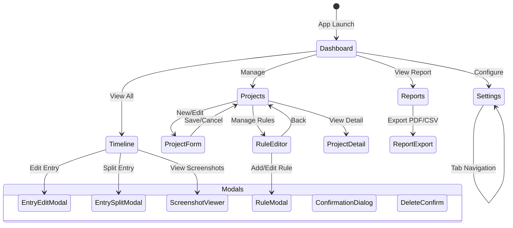

# AutoTracker サイトマップ（画面設計書）

**バージョン:** 1.0  
**作成日:** 2025年12月10日  
**参照:** 01_requirements.md, 02_architecture.md, 03_database.md, 04_api.md

---

## 目次

1. [画面構成概要](#1-画面構成概要)
2. [ナビゲーション構造](#2-ナビゲーション構造)
3. [画面一覧](#3-画面一覧)
4. [画面詳細設計](#4-画面詳細設計)
5. [モーダル・ダイアログ](#5-モーダルダイアログ)
6. [システムトレイ](#6-システムトレイ)
7. [通知](#7-通知)
8. [レスポンシブ対応](#8-レスポンシブ対応)
9. [画面遷移図](#9-画面遷移図)
10. [コンポーネント構成](#10-コンポーネント構成)

---

## 1. 画面構成概要

### 1.1 アプリケーション構造

```
┌─────────────────────────────────────────────────────────────┐
│                      Title Bar                               │
│  ┌─────┐                                    ┌─┬─┬─┐        │
│  │ 🕐  │  AutoTracker           ● Recording │─│□│×│        │
│  └─────┘                                    └─┴─┴─┘        │
├─────────────────────────────────────────────────────────────┤
│ ┌─────────┐ ┌─────────────────────────────────────────────┐ │
│ │         │ │                                             │ │
│ │  Side   │ │                                             │ │
│ │  bar    │ │              Main Content                   │ │
│ │         │ │                                             │ │
│ │ ──────  │ │                                             │ │
│ │ 📊 Dash │ │                                             │ │
│ │ 📅 Time │ │                                             │ │
│ │ 📁 Proj │ │                                             │ │
│ │ 📈 Repo │ │                                             │ │
│ │ ⚙️ Sett │ │                                             │ │
│ │         │ │                                             │ │
│ └─────────┘ └─────────────────────────────────────────────┘ │
└─────────────────────────────────────────────────────────────┘
```

### 1.2 レイアウト仕様

| 要素 | サイズ | 説明 |
|------|--------|------|
| ウィンドウ最小 | 1024 × 768px | 最小ウィンドウサイズ |
| ウィンドウデフォルト | 1280 × 800px | 初期サイズ |
| サイドバー | 64px (折りたたみ) / 240px (展開) | ナビゲーション |
| タイトルバー | 32px | カスタムタイトルバー |
| メインコンテンツ | 可変 | コンテンツエリア |

---

## 2. ナビゲーション構造

### 2.1 サイドバーメニュー

```
┌──────────────────────┐
│  🕐 AutoTracker       │  ← ロゴ/アプリ名
├──────────────────────┤
│                      │
│  📊 ダッシュボード    │  ← /dashboard
│                      │
│  📅 タイムライン      │  ← /timeline
│                      │
│  📁 プロジェクト      │  ← /projects
│                      │
│  📈 レポート         │  ← /reports
│                      │
├──────────────────────┤
│                      │
│  ⚙️ 設定            │  ← /settings
│                      │
│  ❓ ヘルプ           │  ← /help (Phase 3)
│                      │
└──────────────────────┘
```

### 2.2 URL構造（内部ルーティング）

| パス | 画面名 | Phase |
|------|--------|-------|
| `/` | リダイレクト → `/dashboard` | 1 |
| `/dashboard` | ダッシュボード | 1 |
| `/timeline` | タイムライン | 1 |
| `/timeline/:date` | 特定日のタイムライン | 1 |
| `/projects` | プロジェクト一覧 | 1 |
| `/projects/new` | プロジェクト新規作成 | 1 |
| `/projects/:id` | プロジェクト詳細 | 1 |
| `/projects/:id/edit` | プロジェクト編集 | 1 |
| `/projects/:id/rules` | ルール設定 | 1 |
| `/reports` | レポート | 1 |
| `/reports/daily` | 日次レポート | 1 |
| `/reports/weekly` | 週次レポート | 2 |
| `/reports/monthly` | 月次レポート | 2 |
| `/reports/custom` | カスタムレポート | 2 |
| `/settings` | 設定 | 1 |
| `/settings/tracking` | トラッキング設定 | 1 |
| `/settings/notifications` | 通知設定 | 1 |
| `/settings/privacy` | プライバシー設定 | 1 |
| `/settings/appearance` | 外観設定 | 1 |
| `/settings/ai` | AI設定 | 1 |
| `/settings/backup` | バックアップ | 2 |
| `/help` | ヘルプ | 3 |
| `/onboarding` | オンボーディング | 3 |

---

## 3. 画面一覧

### 3.1 Phase 1 (MVP) 画面

| No | 画面ID | 画面名 | 説明 |
|----|--------|--------|------|
| 1 | dashboard | ダッシュボード | 現在の作業状況、今日の統計 |
| 2 | timeline | タイムライン | 時系列での作業記録一覧 |
| 3 | projects | プロジェクト一覧 | プロジェクト管理 |
| 4 | project-detail | プロジェクト詳細 | 個別プロジェクト情報 |
| 5 | project-form | プロジェクトフォーム | 新規作成/編集 |
| 6 | rule-editor | ルール設定 | 自動検出ルール設定 |
| 7 | reports | レポート | 日次レポート |
| 8 | settings | 設定 | アプリ設定 |

### 3.2 Phase 2 画面

| No | 画面ID | 画面名 | 説明 |
|----|--------|--------|------|
| 9 | reports-weekly | 週次レポート | 週間集計 |
| 10 | reports-monthly | 月次レポート | 月間集計 |
| 11 | reports-custom | カスタムレポート | 任意期間 |
| 12 | settings-backup | バックアップ設定 | バックアップ管理 |

### 3.3 Phase 3 画面

| No | 画面ID | 画面名 | 説明 |
|----|--------|--------|------|
| 13 | onboarding | オンボーディング | 初回セットアップ |
| 14 | help | ヘルプ | ヘルプドキュメント |

---

## 4. 画面詳細設計

### 4.1 ダッシュボード (dashboard)

**パス:** `/dashboard`  
**優先度:** Phase 1  
**説明:** アプリのメイン画面。現在の作業状況と今日の統計を表示。

```
┌─────────────────────────────────────────────────────────────┐
│                      DASHBOARD                               │
├─────────────────────────────────────────────────────────────┤
│                                                              │
│  ┌────────────────────────────────────────────────────────┐ │
│  │  🎯 Current Task                                       │ │
│  │  ┌──────────────────────────────────────────────────┐  │ │
│  │  │                                                  │  │ │
│  │  │  📁 TEPCO LINE Marketing                         │  │ │
│  │  │                                                  │  │ │
│  │  │        02:34:15                                  │  │ │
│  │  │                                                  │  │ │
│  │  │  Confidence: ████████░░ 85%                      │  │ │
│  │  │  Subtask: メッセージ作成                          │  │ │
│  │  │                                                  │  │ │
│  │  │  [⏸ Pause]  [⏹ Stop]                            │  │ │
│  │  └──────────────────────────────────────────────────┘  │ │
│  └────────────────────────────────────────────────────────┘ │
│                                                              │
│  ┌──────────────┐ ┌──────────────┐ ┌──────────────┐        │
│  │ Today Total  │ │ Billable     │ │ Projects     │        │
│  │              │ │              │ │              │        │
│  │   06:45      │ │   05:30      │ │     3        │        │
│  │   +1.5h      │ │   ¥27,500    │ │  active      │        │
│  └──────────────┘ └──────────────┘ └──────────────┘        │
│                                                              │
│  ┌────────────────────────────────────────────────────────┐ │
│  │  📅 Recent Timeline                                    │ │
│  │  ┌──────────────────────────────────────────────────┐  │ │
│  │  │ 14:00 ████████████ TEPCO (2h)          95%      │  │ │
│  │  │ 12:00 ████ 昼休憩 (1h)                          │  │ │
│  │  │ 10:00 ██████████ Okinawa SEO (2h)      92%      │  │ │
│  │  │ 09:00 ████ Email確認 (1h)              88%      │  │ │
│  │  └──────────────────────────────────────────────────┘  │ │
│  │                        [View All →]                    │ │
│  └────────────────────────────────────────────────────────┘ │
│                                                              │
└─────────────────────────────────────────────────────────────┘
```

**コンポーネント:**

| コンポーネント | 説明 | API |
|---------------|------|-----|
| CurrentTask | 現在の作業表示 | `tracking:get-status` |
| TodayStats | 今日の統計カード | `entry:get-today` |
| RecentTimeline | 直近のタイムライン | `entry:get-today` |

**アクション:**
- トラッキング開始/停止/一時停止
- タイムラインへ遷移
- エントリー詳細表示

---

### 4.2 タイムライン (timeline)

**パス:** `/timeline`, `/timeline/:date`  
**優先度:** Phase 1  
**説明:** 時系列での作業記録表示と編集。

```
┌─────────────────────────────────────────────────────────────┐
│                      TIMELINE                                │
├─────────────────────────────────────────────────────────────┤
│                                                              │
│  ┌────────────────────────────────────────────────────────┐ │
│  │  📅 December 10, 2025              [◀] [Today] [▶]    │ │
│  └────────────────────────────────────────────────────────┘ │
│                                                              │
│  ┌────────────────────────────────────────────────────────┐ │
│  │  Filter: [All Projects ▼]  [Show Non-Work ☐]          │ │
│  └────────────────────────────────────────────────────────┘ │
│                                                              │
│  ┌────────────────────────────────────────────────────────┐ │
│  │  Total: 6h 45m    Billable: 5h 30m    Revenue: ¥27,500 │ │
│  └────────────────────────────────────────────────────────┘ │
│                                                              │
│  ┌────────────────────────────────────────────────────────┐ │
│  │  TIMELINE                                               │ │
│  │  ─────────────────────────────────────────────────────  │ │
│  │                                                         │ │
│  │  09:00 ┬─────────────────────────────────────────────  │ │
│  │        │ 📁 Email確認                                  │ │
│  │        │ 09:00 - 10:00 (1h)                           │ │
│  │        │ Confidence: 88% ⚠️                           │ │
│  │        │ [Edit] [Split] [Delete]                      │ │
│  │  ──────┴─────────────────────────────────────────────  │ │
│  │                                                         │ │
│  │  10:00 ┬─────────────────────────────────────────────  │ │
│  │        │ 📁 Okinawa Hotel SEO                         │ │
│  │        │ 10:00 - 12:00 (2h)                           │ │
│  │        │ Subtask: キーワード調査                       │ │
│  │        │ Confidence: 92% ✅                           │ │
│  │        │ [Edit] [Split] [Delete]                      │ │
│  │  ──────┴─────────────────────────────────────────────  │ │
│  │                                                         │ │
│  │  12:00 ┬─────────────────────────────────────────────  │ │
│  │        │ 🍽️ 昼休憩 (Non-work)                         │ │
│  │        │ 12:00 - 13:00 (1h)                           │ │
│  │  ──────┴─────────────────────────────────────────────  │ │
│  │                                                         │ │
│  │  14:00 ┬─────────────────────────────────────────────  │ │
│  │        │ 📁 TEPCO LINE Marketing                      │ │
│  │        │ 14:00 - now (2h 34m) ● Recording             │ │
│  │        │ Subtask: メッセージ作成                       │ │
│  │        │ Confidence: 95% ✅                           │ │
│  │        │ [View Screenshots]                           │ │
│  │  ──────┴─────────────────────────────────────────────  │ │
│  │                                                         │ │
│  │                    [+ Add Entry]                        │ │
│  └────────────────────────────────────────────────────────┘ │
│                                                              │
└─────────────────────────────────────────────────────────────┘
```

**コンポーネント:**

| コンポーネント | 説明 | API |
|---------------|------|-----|
| DatePicker | 日付選択 | - |
| TimelineFilter | フィルター | - |
| DaySummary | 日次サマリー | `entry:get-by-date-range` |
| TimelineEntry | 個別エントリー | - |
| EntryActions | 編集/分割/削除 | `entry:update/split/delete` |

**アクション:**
- 日付切り替え
- エントリー編集（インライン）
- エントリー分割
- エントリー削除
- 手動エントリー追加
- スクリーンショット表示

---

### 4.3 プロジェクト一覧 (projects)

**パス:** `/projects`  
**優先度:** Phase 1  
**説明:** プロジェクト/案件の一覧表示。

```
┌─────────────────────────────────────────────────────────────┐
│                      PROJECTS                                │
├─────────────────────────────────────────────────────────────┤
│                                                              │
│  ┌────────────────────────────────────────────────────────┐ │
│  │  [+ New Project]                    [Show Archived ☐]  │ │
│  └────────────────────────────────────────────────────────┘ │
│                                                              │
│  ┌────────────────────────────────────────────────────────┐ │
│  │                                                         │ │
│  │  ┌─────────────────────────────────────────────────┐   │ │
│  │  │ ● TEPCO LINE Marketing                          │   │ │
│  │  │   Client: 東京電力                               │   │ │
│  │  │   ¥5,000/h  |  Budget: 40h  |  Used: 32h (80%)  │   │ │
│  │  │   This month: 15h 30m                           │   │ │
│  │  │   ████████████████░░░░ 80%                      │   │ │
│  │  │                                                 │   │ │
│  │  │   Rules: 3 active                               │   │ │
│  │  │   [Edit] [Rules] [Archive]                      │   │ │
│  │  └─────────────────────────────────────────────────┘   │ │
│  │                                                         │ │
│  │  ┌─────────────────────────────────────────────────┐   │ │
│  │  │ ● Okinawa Hotel SEO                             │   │ │
│  │  │   Client: 沖縄リゾート                           │   │ │
│  │  │   ¥4,000/h  |  Budget: 30h  |  Used: 12h (40%)  │   │ │
│  │  │   This month: 8h 15m                            │   │ │
│  │  │   ████████░░░░░░░░░░░░ 40%                      │   │ │
│  │  │                                                 │   │ │
│  │  │   Rules: 2 active                               │   │ │
│  │  │   [Edit] [Rules] [Archive]                      │   │ │
│  │  └─────────────────────────────────────────────────┘   │ │
│  │                                                         │ │
│  │  ┌─────────────────────────────────────────────────┐   │ │
│  │  │ ● SafeReply Development                         │   │ │
│  │  │   Personal project                              │   │ │
│  │  │   No budget set                                 │   │ │
│  │  │   This month: 22h 45m                           │   │ │
│  │  │                                                 │   │ │
│  │  │   Rules: 2 active                               │   │ │
│  │  │   [Edit] [Rules] [Archive]                      │   │ │
│  │  └─────────────────────────────────────────────────┘   │ │
│  │                                                         │ │
│  └────────────────────────────────────────────────────────┘ │
│                                                              │
└─────────────────────────────────────────────────────────────┘
```

**コンポーネント:**

| コンポーネント | 説明 | API |
|---------------|------|-----|
| ProjectCard | プロジェクトカード | `project:get-all` |
| BudgetProgress | 予算進捗バー | - |
| ProjectActions | 編集/ルール/アーカイブ | - |

---

### 4.4 プロジェクトフォーム (project-form)

**パス:** `/projects/new`, `/projects/:id/edit`  
**優先度:** Phase 1  
**説明:** プロジェクト新規作成/編集フォーム。

```
┌─────────────────────────────────────────────────────────────┐
│                    NEW PROJECT                               │
├─────────────────────────────────────────────────────────────┤
│                                                              │
│  ┌────────────────────────────────────────────────────────┐ │
│  │                                                         │ │
│  │  Project Name *                                         │ │
│  │  ┌─────────────────────────────────────────────────┐   │ │
│  │  │ TEPCO LINE Marketing                            │   │ │
│  │  └─────────────────────────────────────────────────┘   │ │
│  │                                                         │ │
│  │  Client Name                                            │ │
│  │  ┌─────────────────────────────────────────────────┐   │ │
│  │  │ 東京電力                                        │   │ │
│  │  └─────────────────────────────────────────────────┘   │ │
│  │                                                         │ │
│  │  Color          Icon                                    │ │
│  │  ┌───────┐     ┌───────┐                               │ │
│  │  │ 🟢    │ ▼   │ 📁    │ ▼                             │ │
│  │  └───────┘     └───────┘                               │ │
│  │                                                         │ │
│  │  Hourly Rate                                            │ │
│  │  ┌─────────────────────────────────────────────────┐   │ │
│  │  │ ¥ 5000                                          │   │ │
│  │  └─────────────────────────────────────────────────┘   │ │
│  │                                                         │ │
│  │  Monthly Budget (hours)                                 │ │
│  │  ┌─────────────────────────────────────────────────┐   │ │
│  │  │ 40                                              │   │ │
│  │  └─────────────────────────────────────────────────┘   │ │
│  │                                                         │ │
│  │                                                         │ │
│  │  ┌─────────────┐  ┌─────────────┐                      │ │
│  │  │   Cancel    │  │    Save     │                      │ │
│  │  └─────────────┘  └─────────────┘                      │ │
│  │                                                         │ │
│  └────────────────────────────────────────────────────────┘ │
│                                                              │
└─────────────────────────────────────────────────────────────┘
```

**バリデーション:**
- name: 必須、1-100文字
- hourlyRate: 0以上（任意）
- budgetHours: 0以上（任意）

---

### 4.5 ルール設定 (rule-editor)

**パス:** `/projects/:id/rules`  
**優先度:** Phase 1  
**説明:** プロジェクトの自動検出ルール設定。

```
┌─────────────────────────────────────────────────────────────┐
│              RULES - TEPCO LINE Marketing                    │
├─────────────────────────────────────────────────────────────┤
│                                                              │
│  ┌────────────────────────────────────────────────────────┐ │
│  │  [← Back to Project]                    [+ Add Rule]   │ │
│  └────────────────────────────────────────────────────────┘ │
│                                                              │
│  ┌────────────────────────────────────────────────────────┐ │
│  │  Active Rules (3)                                       │ │
│  │  ─────────────────────────────────────────────────────  │ │
│  │                                                         │ │
│  │  ┌───────────────────────────────────────────────────┐ │ │
│  │  │ ☑ Keyword Match                      Priority: 10 │ │ │
│  │  │   Pattern: ["TEPCO", "東京電力", "LINE"]           │ │ │
│  │  │   [Test] [Edit] [Delete]                          │ │ │
│  │  └───────────────────────────────────────────────────┘ │ │
│  │                                                         │ │
│  │  ┌───────────────────────────────────────────────────┐ │ │
│  │  │ ☑ URL Match                          Priority: 5  │ │ │
│  │  │   Pattern: https://chat.line.biz/.*               │ │ │
│  │  │   [Test] [Edit] [Delete]                          │ │ │
│  │  └───────────────────────────────────────────────────┘ │ │
│  │                                                         │ │
│  │  ┌───────────────────────────────────────────────────┐ │ │
│  │  │ ☑ Window Title Match                 Priority: 3  │ │ │
│  │  │   Pattern: .*LINE Official.*                      │ │ │
│  │  │   [Test] [Edit] [Delete]                          │ │ │
│  │  └───────────────────────────────────────────────────┘ │ │
│  │                                                         │ │
│  └────────────────────────────────────────────────────────┘ │
│                                                              │
│  ┌────────────────────────────────────────────────────────┐ │
│  │  💡 Tips                                                │ │
│  │  • 優先度が高いルールが先にマッチします                  │ │
│  │  • キーワードは OR 条件で評価されます                   │ │
│  │  • 正規表現が使えます（URL、ウィンドウタイトル）         │ │
│  └────────────────────────────────────────────────────────┘ │
│                                                              │
└─────────────────────────────────────────────────────────────┘
```

---

### 4.6 レポート (reports)

**パス:** `/reports`, `/reports/daily`  
**優先度:** Phase 1 (日次), Phase 2 (週次/月次)  
**説明:** 作業レポートの表示とエクスポート。

```
┌─────────────────────────────────────────────────────────────┐
│                       REPORTS                                │
├─────────────────────────────────────────────────────────────┤
│                                                              │
│  ┌────────────────────────────────────────────────────────┐ │
│  │  [Daily]  [Weekly]  [Monthly]  [Custom]                │ │
│  └────────────────────────────────────────────────────────┘ │
│                                                              │
│  ┌────────────────────────────────────────────────────────┐ │
│  │  📅 December 10, 2025              [◀] [Today] [▶]    │ │
│  └────────────────────────────────────────────────────────┘ │
│                                                              │
│  ┌──────────────┐ ┌──────────────┐ ┌──────────────┐        │
│  │ Total Hours  │ │ Billable     │ │ Revenue      │        │
│  │              │ │              │ │              │        │
│  │   06:45      │ │   05:30      │ │   ¥27,500    │        │
│  └──────────────┘ └──────────────┘ └──────────────┘        │
│                                                              │
│  ┌────────────────────────────────────────────────────────┐ │
│  │  Project Breakdown                                      │ │
│  │  ┌──────────────────────────────────────────────────┐  │ │
│  │  │                                                  │  │ │
│  │  │    ┌─────────────────────────────────────────┐   │  │ │
│  │  │    │   ████████  TEPCO (45%)    3h 00m       │   │  │ │
│  │  │    │   ████      Okinawa (30%)  2h 00m       │   │  │ │
│  │  │    │   ███       SafeReply (25%) 1h 45m      │   │  │ │
│  │  │    └─────────────────────────────────────────┘   │  │ │
│  │  │                                                  │  │ │
│  │  │    [Pie Chart]                                   │  │ │
│  │  │                                                  │  │ │
│  │  └──────────────────────────────────────────────────┘  │ │
│  └────────────────────────────────────────────────────────┘ │
│                                                              │
│  ┌────────────────────────────────────────────────────────┐ │
│  │  Details                                                │ │
│  │  ┌──────────────────────────────────────────────────┐  │ │
│  │  │ Project              Hours    Rate     Revenue   │  │ │
│  │  │ ─────────────────────────────────────────────── │  │ │
│  │  │ TEPCO LINE Marketing  3h 00m  ¥5,000  ¥15,000   │  │ │
│  │  │ Okinawa Hotel SEO     2h 00m  ¥4,000  ¥8,000    │  │ │
│  │  │ SafeReply Dev         1h 45m  -       -         │  │ │
│  │  │ ─────────────────────────────────────────────── │  │ │
│  │  │ Total                 6h 45m          ¥23,000   │  │ │
│  │  └──────────────────────────────────────────────────┘  │ │
│  └────────────────────────────────────────────────────────┘ │
│                                                              │
│  ┌────────────────────────────────────────────────────────┐ │
│  │             [📄 Export PDF]  [📊 Export CSV]           │ │
│  └────────────────────────────────────────────────────────┘ │
│                                                              │
└─────────────────────────────────────────────────────────────┘
```

---

### 4.7 設定 (settings)

**パス:** `/settings`  
**優先度:** Phase 1  
**説明:** アプリケーション設定。

```
┌─────────────────────────────────────────────────────────────┐
│                       SETTINGS                               │
├─────────────────────────────────────────────────────────────┤
│                                                              │
│  ┌────────────────────────────────────────────────────────┐ │
│  │  [Tracking] [Notifications] [Privacy] [Appearance] [AI]│ │
│  └────────────────────────────────────────────────────────┘ │
│                                                              │
│  ┌────────────────────────────────────────────────────────┐ │
│  │  TRACKING SETTINGS                                      │ │
│  │  ─────────────────────────────────────────────────────  │ │
│  │                                                         │ │
│  │  Screenshot Interval                                    │ │
│  │  ┌─────────────────────────────────────────────────┐   │ │
│  │  │ ○ 30 seconds  ● 1 minute  ○ 2 minutes          │   │ │
│  │  └─────────────────────────────────────────────────┘   │ │
│  │                                                         │ │
│  │  AI Judgment Mode                                       │ │
│  │  ┌─────────────────────────────────────────────────┐   │ │
│  │  │ ○ Aggressive  ● Standard  ○ Conservative       │   │ │
│  │  └─────────────────────────────────────────────────┘   │ │
│  │  ℹ️ Standard: 変化時のみAI判定（推奨）                  │ │
│  │                                                         │ │
│  │  Auto Start on Boot                                     │ │
│  │  ┌─────────────────────────────────────────────────┐   │ │
│  │  │ [✓] Start AutoTracker when computer starts      │   │ │
│  │  └─────────────────────────────────────────────────┘   │ │
│  │                                                         │ │
│  │  Break Detection                                        │ │
│  │  ┌─────────────────────────────────────────────────┐   │ │
│  │  │ ○ 10 minutes  ● 15 minutes  ○ 30 minutes       │   │ │
│  │  └─────────────────────────────────────────────────┘   │ │
│  │  ℹ️ この時間無操作で休憩と判定                          │ │
│  │                                                         │ │
│  └────────────────────────────────────────────────────────┘ │
│                                                              │
│  ┌────────────────────────────────────────────────────────┐ │
│  │                     [Reset to Defaults]                 │ │
│  └────────────────────────────────────────────────────────┘ │
│                                                              │
└─────────────────────────────────────────────────────────────┘
```

**設定タブ:**

| タブ | 設定項目 |
|------|----------|
| Tracking | キャプチャ間隔、AI判定モード、自動起動、休憩検出 |
| Notifications | 確認モード、異常アラート、レポートリマインダー |
| Privacy | スクリーンショット保存期間、パスワード検出、除外キーワード |
| Appearance | テーマ、アクセントカラー、フォントサイズ |
| AI | 月間予算、バッチモード、使用状況 |

---

## 5. モーダル・ダイアログ

### 5.1 エントリー編集モーダル

```
┌─────────────────────────────────────────┐
│  Edit Entry                        [×] │
├─────────────────────────────────────────┤
│                                         │
│  Project                                │
│  ┌─────────────────────────────────┐   │
│  │ TEPCO LINE Marketing        ▼  │   │
│  └─────────────────────────────────┘   │
│                                         │
│  Start Time        End Time             │
│  ┌──────────────┐ ┌──────────────┐     │
│  │ 14:00        │ │ 16:34        │     │
│  └──────────────┘ └──────────────┘     │
│                                         │
│  Subtask                                │
│  ┌─────────────────────────────────┐   │
│  │ メッセージ作成                  │   │
│  └─────────────────────────────────┘   │
│                                         │
│  ☐ Non-work (休憩など)                  │
│                                         │
│  ┌─────────────┐  ┌─────────────┐      │
│  │   Cancel    │  │    Save     │      │
│  └─────────────┘  └─────────────┘      │
│                                         │
└─────────────────────────────────────────┘
```

### 5.2 確認ダイアログ（AI判定）

```
┌─────────────────────────────────────────┐
│  Confirm Project                   [×] │
├─────────────────────────────────────────┤
│                                         │
│  🤖 AI detected a project change        │
│                                         │
│  Suggested: TEPCO LINE Marketing        │
│  Confidence: 78% ⚠️                     │
│                                         │
│  ┌─────────────────────────────────┐   │
│  │ [Screenshot Preview]            │   │
│  └─────────────────────────────────┘   │
│                                         │
│  Is this correct?                       │
│                                         │
│  ● Yes, this is correct                 │
│  ○ No, it's: [Select Project ▼]        │
│  ○ Split: Different before/after        │
│                                         │
│  ┌─────────────┐  ┌─────────────┐      │
│  │   Dismiss   │  │   Confirm   │      │
│  └─────────────┘  └─────────────┘      │
│                                         │
└─────────────────────────────────────────┘
```

### 5.3 ルール追加モーダル

```
┌─────────────────────────────────────────┐
│  Add Rule                          [×] │
├─────────────────────────────────────────┤
│                                         │
│  Rule Type                              │
│  ┌─────────────────────────────────┐   │
│  │ Keyword Match                ▼  │   │
│  └─────────────────────────────────┘   │
│                                         │
│  Pattern                                │
│  ┌─────────────────────────────────┐   │
│  │ TEPCO, 東京電力, LINE           │   │
│  └─────────────────────────────────┘   │
│  ℹ️ カンマ区切りで複数キーワード        │
│                                         │
│  Priority                               │
│  ┌─────────────────────────────────┐   │
│  │ 10                              │   │
│  └─────────────────────────────────┘   │
│                                         │
│  ┌─────────────────────────────────┐   │
│  │ [Test Rule]                     │   │
│  │ Result: ✅ Matches current screen│  │
│  └─────────────────────────────────┘   │
│                                         │
│  ┌─────────────┐  ┌─────────────┐      │
│  │   Cancel    │  │    Add      │      │
│  └─────────────┘  └─────────────┘      │
│                                         │
└─────────────────────────────────────────┘
```

### 5.4 削除確認ダイアログ

```
┌─────────────────────────────────────────┐
│  Delete Project?                   [×] │
├─────────────────────────────────────────┤
│                                         │
│  ⚠️ Are you sure you want to delete    │
│  "TEPCO LINE Marketing"?                │
│                                         │
│  • All rules will be deleted            │
│  • Entries will be kept (unassigned)    │
│                                         │
│  ┌─────────────┐  ┌─────────────┐      │
│  │   Cancel    │  │   Delete    │      │
│  └─────────────┘  └─────────────┘      │
│                                         │
└─────────────────────────────────────────┘
```

---

## 6. システムトレイ

### 6.1 トレイメニュー

```
┌─────────────────────────────┐
│ 🕐 AutoTracker              │
├─────────────────────────────┤
│ ● Recording: 02:34:15       │
│ 📁 TEPCO LINE Marketing     │
├─────────────────────────────┤
│ ⏸ Pause Tracking           │
│ ⏹ Stop Tracking            │
├─────────────────────────────┤
│ 📊 Open Dashboard           │
│ ⚙️ Settings                 │
├─────────────────────────────┤
│ 🚪 Quit                     │
└─────────────────────────────┘
```

### 6.2 トレイアイコン状態

| 状態 | アイコン | 説明 |
|------|---------|------|
| Recording | 🟢 | トラッキング中 |
| Paused | 🟡 | 一時停止中 |
| Stopped | ⚪ | 停止中 |
| Error | 🔴 | エラー発生 |

---

## 7. 通知

### 7.1 通知タイプ

| タイプ | トリガー | 表示時間 |
|--------|---------|---------|
| Confirmation | AI信頼度<85% | クリックまで |
| Anomaly | 異常検知 | 5秒 |
| Reminder | 日次レポート確認 | 5秒 |
| Budget Warning | AI予算80%超過 | 5秒 |
| Error | エラー発生 | クリックまで |

### 7.2 通知デザイン

```
┌────────────────────────────────────────────────┐
│ 🤖 Project Change Detected                 [×] │
│                                                 │
│ Is this TEPCO LINE Marketing?                  │
│ Confidence: 78%                                │
│                                                 │
│ [Yes]  [No, Change]  [Dismiss]                 │
└────────────────────────────────────────────────┘
```

---

## 8. レスポンシブ対応

### 8.1 ブレークポイント

| ブレークポイント | 幅 | サイドバー | レイアウト |
|----------------|-----|----------|----------|
| Desktop | 1280px+ | 展開（240px） | 3カラム |
| Tablet | 1024-1279px | 折りたたみ（64px） | 2カラム |
| Compact | 1024px未満 | 非対応 | - |

※最小ウィンドウサイズ: 1024×768px

### 8.2 サイドバー挙動

```
Desktop (1280px+):
┌──────────┬────────────────────────────────────┐
│ ロゴ     │                                    │
│ ───────  │                                    │
│ 📊 ダッシュ │           Main Content             │
│ 📅 タイム  │                                    │
│ 📁 プロジェ │                                    │
└──────────┴────────────────────────────────────┘

Tablet (1024-1279px):
┌────┬─────────────────────────────────────────┐
│ 🕐 │                                         │
│ ── │                                         │
│ 📊 │            Main Content                 │
│ 📅 │                                         │
│ 📁 │                                         │
└────┴─────────────────────────────────────────┘
```

---

## 9. 画面遷移図



---

## 10. コンポーネント構成

### 10.1 コンポーネントツリー

```
App
├── Layout
│   ├── Sidebar
│   │   ├── Logo
│   │   ├── NavItem (Dashboard)
│   │   ├── NavItem (Timeline)
│   │   ├── NavItem (Projects)
│   │   ├── NavItem (Reports)
│   │   └── NavItem (Settings)
│   └── MainContent
│       └── [Router Outlet]
│
├── Pages
│   ├── Dashboard
│   │   ├── CurrentTask
│   │   │   ├── ProjectBadge
│   │   │   ├── Timer
│   │   │   ├── ConfidenceMeter
│   │   │   └── ActionButtons
│   │   ├── TodayStats
│   │   │   └── StatCard (×3)
│   │   └── RecentTimeline
│   │       └── TimelineEntry (×n)
│   │
│   ├── Timeline
│   │   ├── DateNavigator
│   │   ├── TimelineFilter
│   │   ├── DaySummary
│   │   └── TimelineList
│   │       └── TimelineEntry (×n)
│   │           ├── ProjectBadge
│   │           ├── TimeRange
│   │           ├── ConfidenceBadge
│   │           └── EntryActions
│   │
│   ├── Projects
│   │   ├── ProjectHeader
│   │   └── ProjectList
│   │       └── ProjectCard (×n)
│   │           ├── ProjectInfo
│   │           ├── BudgetProgress
│   │           └── ProjectActions
│   │
│   ├── ProjectForm
│   │   └── Form
│   │       ├── TextInput (name)
│   │       ├── TextInput (client)
│   │       ├── ColorPicker
│   │       ├── IconPicker
│   │       ├── NumberInput (rate)
│   │       └── NumberInput (budget)
│   │
│   ├── RuleEditor
│   │   └── RuleList
│   │       └── RuleItem (×n)
│   │
│   ├── Reports
│   │   ├── ReportTabs
│   │   ├── DateNavigator
│   │   ├── ReportSummary
│   │   ├── ProjectChart
│   │   ├── DetailTable
│   │   └── ExportButtons
│   │
│   └── Settings
│       ├── SettingsTabs
│       └── SettingsSection (×n)
│           └── SettingItem (×n)
│
├── Modals
│   ├── EntryEditModal
│   ├── EntrySplitModal
│   ├── ConfirmationDialog
│   ├── RuleModal
│   ├── DeleteConfirmModal
│   └── ScreenshotViewer
│
└── Common
    ├── Button
    ├── Input
    ├── Select
    ├── Checkbox
    ├── Toggle
    ├── Badge
    ├── Card
    ├── Modal
    ├── Toast
    ├── Tooltip
    └── Spinner
```

### 10.2 主要コンポーネント仕様

| コンポーネント | Props | 説明 |
|---------------|-------|------|
| `CurrentTask` | `status: TrackingStatus` | 現在の作業表示 |
| `TimelineEntry` | `entry: EntryWithProject`, `onEdit`, `onSplit`, `onDelete` | タイムラインの1エントリー |
| `ProjectCard` | `project: Project`, `onEdit`, `onRules`, `onArchive` | プロジェクトカード |
| `ConfidenceBadge` | `value: number` | 信頼度表示（色分け） |
| `ProjectBadge` | `project: Project` | プロジェクト名+カラー表示 |
| `BudgetProgress` | `used: number`, `budget: number` | 予算進捗バー |

---

## 付録

### A. デザイントークン（再掲）

```css
/* Colors - Dark Theme */
--color-bg-primary: #0D0D0D;
--color-bg-secondary: #1A1A1A;
--color-bg-tertiary: #252525;
--color-accent-primary: #E5C890;
--color-accent-success: #81C784;
--color-accent-warning: #FFB74D;
--color-accent-error: #E57373;
--color-text-primary: #F5F5F5;
--color-text-secondary: #A0A0A0;

/* Typography */
--font-family: 'Inter', sans-serif;
--font-mono: 'JetBrains Mono', monospace;
--font-size-xs: 12px;
--font-size-sm: 14px;
--font-size-md: 16px;
--font-size-lg: 18px;
--font-size-xl: 24px;
--font-size-2xl: 32px;

/* Spacing */
--space-1: 4px;
--space-2: 8px;
--space-3: 12px;
--space-4: 16px;
--space-5: 24px;
--space-6: 32px;
--space-8: 48px;

/* Border Radius */
--radius-sm: 4px;
--radius-md: 8px;
--radius-lg: 12px;
--radius-full: 9999px;

/* Shadows */
--shadow-sm: 0 1px 2px rgba(0,0,0,0.3);
--shadow-md: 0 4px 6px rgba(0,0,0,0.3);
--shadow-lg: 0 10px 15px rgba(0,0,0,0.3);
```

### B. 画面IDとパスのマッピング

| 画面ID | パス | コンポーネント |
|--------|------|---------------|
| dashboard | `/dashboard` | `Dashboard.tsx` |
| timeline | `/timeline` | `Timeline.tsx` |
| timeline-date | `/timeline/:date` | `Timeline.tsx` |
| projects | `/projects` | `Projects.tsx` |
| project-new | `/projects/new` | `ProjectForm.tsx` |
| project-detail | `/projects/:id` | `ProjectDetail.tsx` |
| project-edit | `/projects/:id/edit` | `ProjectForm.tsx` |
| project-rules | `/projects/:id/rules` | `RuleEditor.tsx` |
| reports | `/reports` | `Reports.tsx` |
| reports-daily | `/reports/daily` | `Reports.tsx` |
| reports-weekly | `/reports/weekly` | `Reports.tsx` |
| reports-monthly | `/reports/monthly` | `Reports.tsx` |
| settings | `/settings` | `Settings.tsx` |

---

**END OF DOCUMENT**
